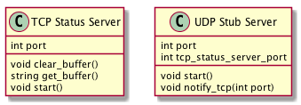
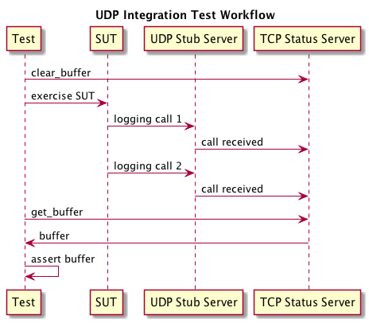
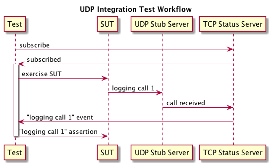

# UDP Stub Server

A UDP Stub Server can be a powerful tool in automated system test arsenal.  Two popular services, statsd and syslog
both default to UDP.  Because of how critical both of these services are to an application and the critical 
visibility they provide, it can often-times be aluable to automate tests for application clients can succesfully
integrate with UDP based services.

We need to verify UDP integration for these critical services regularly, in a reliable repeatable way,
before deploying to a target environment.
While a UDP stub server is not a substitute for testing integration with actual UDP production services, it can 
provide fast verification of a client's use of the UDP protocol, and communication issues related to it.  It can also 
be used to drive event-based-system tests, by having a test listen to specific logging events, and drive test execution
in response to those events (other article).

The UDP stub server consists of 2 components: a UDP stub server which the System Under Test (SUT) will integrate with, and a 
TCP status server that the UDP stub server will integrate with.  The UDP stub server will forward all messages it receives
to the TCP status server, and the  test client will only interact with the TCP status server.  Leveraging TCP in addition
to a UDP stub server affords the client (the test) a number of benefits: reliable ordered transmission, statefulness 
to aggregate multiple messages, exposed commands (clear buffer, read buffer), and the ability to estabilish a persistant
connections to push received message updates to.

### UDP stub server components

The UDP stub server read loop:

  - <- Receives message 
  - -> Sends message to TCP test server

### Test flow using UDP stub server

This simple server should allow for network protocol based testing.  The chart below 
illustrates a common test flow that allows assertions based on messages emitted by the
SUT.

### Overriding UDP logging as asynchronous test driver

Since logging usually contains important program state information, it can be used to
asynchronously drive test, if the server exposes a way to notify a client of events
it receives.  Using an asynchronous event based approach to drive service tests helps
to minimize timing based flakiness, as the tests needs to apply inputs and make assertions
based on states of the SUT.

Using the UDP service to listen to event logs and exposing a persistent connection for the
TCP status server to push UDP message receives to a client, is a way to achieve this
without modifying the SUT to directly support.

- client supports syslog handler
- state change level is logged at syslog handler
- test opens a persistent connection to TCP status server
- when TCP status server receives updates it pushes those to the test client
- test client performs testing steps or assertions based on messages received

This process can be illustrated in the following diagram:

With the persistent connection, the test now has real time, instantaneous insight
into what the SUT is doing.
