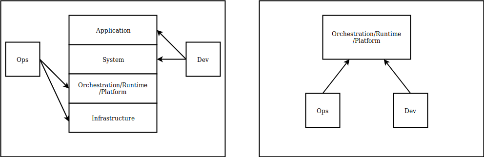

# DevOps: Containers: Velocity Through Reduced Coordination

Containers have a profound impact on software organizational structure by providing a primitive which enables feature teams to fully control their system as well as application level dependencies.  Containers decouple development and operations using a common interface, which enables an increase velocity by reducing the number of times teams need to coordinate externally in order to deliver software.

There are many amazing technical overviews on what containers are and how to use and product ionize them.  Much less is written about how containers have the affect on delivery that they do.

## Decoupling Operations and Development

This post assumes knowledge of docker containers.

In many traaditional (pre-container) organizations operations is responsible for both infrastructure (networking, filesystems, provisioning, etc) and system level resrouces, application directory structures system libraries such as runtime versions, operating system versions (Shown below on left).  

Containers shift this by enabling development to control system level dependencies (REFERENCE) (shown on right in above image). The core benefit of containers comes from shifts developpment one level down the level of software abastraction.

Containers also introduce a new layer of abstraction.  Containerized infrastructure inserts a new layer the runtime/orchestrator/ or platform bwtwren the infrastructure and the system.  This acts as an interface in the traditional software sends that  decouples the dev and ops. This interface general exposes configuration around cpu memory, environment around number and type , web vs asynchronous queue baes (worker)z of application instance.  Combined with the container primitive which supports controlling application and surface stem leve deenedencirs, these provide
 developers everything they need to ship the majority of features without synchronizing with  ops.  Containers redraw the traditional dependency lines

  

Deployment primitive, AMI, package mutable, Mixed Concerns, JRE

Executing on the system
Tight runtime coupling between operations and development.

Where's releases traditionally required both development and anoperations to deploy,

  

This simple change has the affect of decoupling operations and development from each deploy, enabling developers to own configuration, system libraries, application, and application configuration:

  

Containers increase velocity by reducing the number of times teams need to coordinate externally in order to deliver software.

## Development/Deployment Overhead

Runtime related are often "DRY" meaning

Configuration management is usually the highest risk, most executed, and most poorly tested.  Having  strict dependency on remote resources makes this difficult and time consuming to execute locally.  

Because of this there are Super long feedback loops on infrastructure changes.

because this is a request that all teams shares the queue can take hours or days

creates a sequence diagrams where the feature team must synchronize with the operations team, which has a significant negative impact on throughput.  The same synchronization is often required during incidents, which leads to the inverse affect on MTTR, prolonging application service outages and degradation.
The case of system, configuration or ops owned deployments create strict dependencies between operations and dev in order to deliver working software to production:

  

  

Separate team is involved with value delivery , involving synchronization and organizational hops.  These teams service multiple development teams and often have their own [queue](QUEUEING THEORY) of work taking hours or days, or potentially longer.

These hand offs create a nightmare for delivery accounting, is the feature done when it's handed off? Many organizations have such long deployment loops stories are marked as DONE when they are merged into master and not when they are built and deployed.
Feature Deployment

what's the fastest conceivable time to explain a system change get someone to look at it? if someones' available it might be 10 minutes, but on the other end I've personally waited (and seen people wait) days. What's your average and median change time when cross team coordination is required? how long? does it take? if a 1 day (8 hour feature has a 2 hour review process that's 25% synchronization overhead)  a 5 day (8hours / day * 5=40 hour)with a 2 hour review process has a 5% overhead.  The reason containers (docker) is so often mentioned with DevOps is because it enforces a strict technical abstraction between teams and ops which isn't [leaky](leak abstraction) (which is referred to as a platform.)  

### Resources
- https://kubernetes.io/docs/concepts/overview/what-is-kubernetes/
- https://www.freecodecamp.org/news/demystifying-containers-101-a-deep-dive-into-container-technology-for-beginners-d7b60d8511c1/
-
