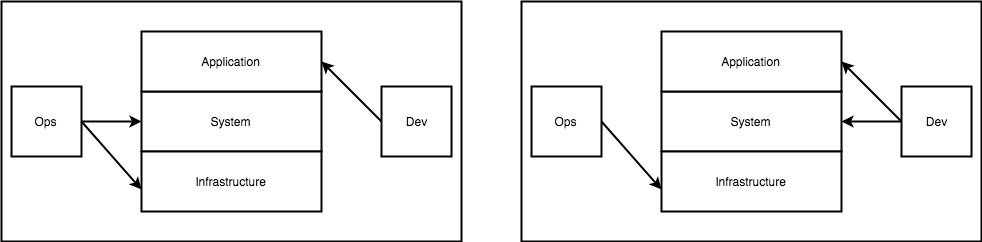
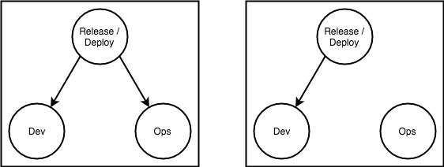
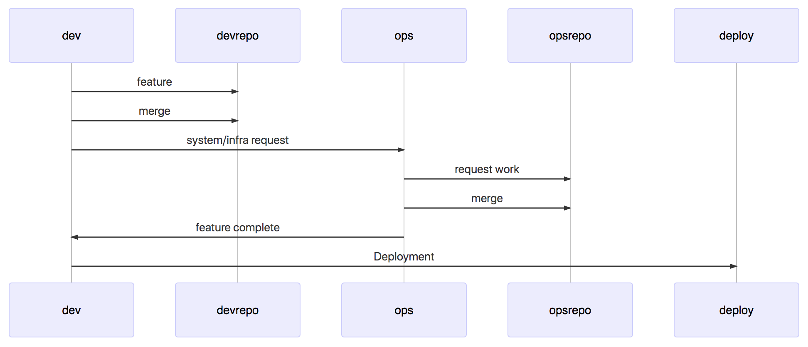
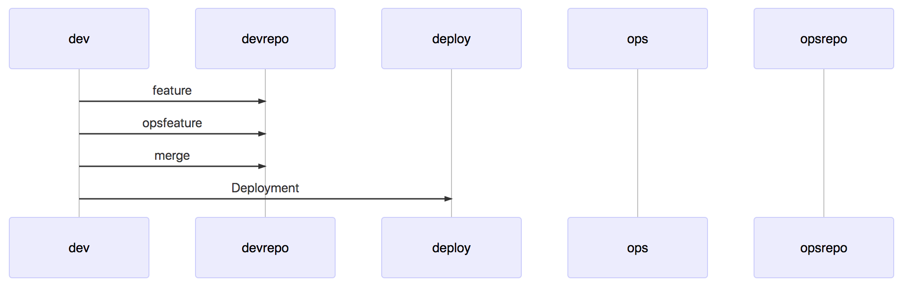

# DevOps for Decision Makers: Containers Affect On Software Delivery

Containers completely change a software organizational structure.  Containers provide a contained primitive which allows feature teams to fully control theri system as well as application level dependencies and package and execute them as an immutable object.  This has significant impact on organizational structure by removing connections, and results in a large throughput on deployment velocity.

Container is the only current DevOps primitive, enabling engineers to fully control both their application and system dependencies in a single artifact.  

There are manay amazing technical overviews on what containers are and how to use and productionize them.  Much less is written about how containers have the affect on ndelivery that they do.

This post assumes knowledge of docker containers.

Traditional:

Operations / Development

## Decouples operations / Development

  

Deployment primitive, AMI, package mutable, Mixed Concerns, JRE

Executing on the system
Tight runtime coupling between operations and development.

This simple change has the affect of decoupling operations and development from each deploy, enabling developers to own configuration, system libraries, application, and application configuration:

  

## Reusable Software Team Operations Team Coupling

Runtime related are often "DRY" meaning

Configuration management is usually the highest risk, most executed, and most poorly tested.  Having  strict dependency on remote resources makes this difficult and time consuming to execute locally.  

Because of this there are Super long feedback loops on infrastructure changes.

because this is a request that all teams shares the queue can take hours or days

creates a sequence diagrams where the feature team must synchronize with the operations team, which has a significant negative impact on throughput.  The same synchronization is often required during incidents, which leads to the inverse affect on MTTR, prolonging application service outages and degradation.
The case of system, configuration or ops owned deployments create strict dependencies between operations and dev in order to deliver working software to production:

  

SEQUENCE DIAGRAM SHOWING FEATURE TEAM -> OPS
OPS ->

FEATURE BRANCH
-> System
-> Operation
-> Merged to master
-> deployed

  

separate team is involved with value delivery , involving synchronization and organizational hops.  These teams service multiple development teams and often have their own [queue](QUEUEING THEORY) of work taking hours or days, or potentially longer.

These hand offs create a nightmare for delivery accounting, is the feature done when it's handed off? Many organizations have such long deployment loops stories are marked as DONE when they are merged into master and not when they are built and deployed.
Feature Deployment

SHOW AWS vs

- Application

Traditional has application intermixed with

what's the fastest conceivable time to explain a system change get someone to look at it? if someones' available it might be 10 minutes, but on the other end I've personally waited (and seen people wait) days. What's your average and median change time when cross team coordination is required? how long? does it take? if a 1 day (8 hour feature has a 2 hour review process that's 25% synchronization overhead)  a 5 day (8hours / day * 5=40 hour)with a 2 hour review process has a 5% overhead.  The reason containers (docker) is so often mentioned with DevOps is because it enforces a strict technical abstraction between teams and ops which isn't [leaky](leak abstraction) (which is referred to as a platform.)  

## Hermetic Build Artifact

Other application artifacts like jars can be built locally ami's require amazon infrastructure, and are cumbersome to execute.  Containers on the other hand are completely self contained coupling both system and

Another crucial part of why containers are DevOps primitive has to do with the ability to create an immutable build artifact.

Runtime packages or application level pacakges, still allow for the strict separation of dev and ops along the application/system boundary.  Above discusses why and how containers address this.  A popular immutible build artificat is a machine image Tools like `packer` try to address this by providing a uniform abstraction layer, unfortunately the artificats that are being generated are so different that the packer abstraction isn't able to unite dev and ops or insulate one from the other.  The other huge issue is that cloud provider machine images have a long feedback loop:

Container images are executable bit for bit locally or remotely,  debugging application/ system

### Resources
- https://kubernetes.io/docs/concepts/overview/what-is-kubernetes/
- https://www.freecodecamp.org/news/demystifying-containers-101-a-deep-dive-into-container-technology-for-beginners-d7b60d8511c1/
-
