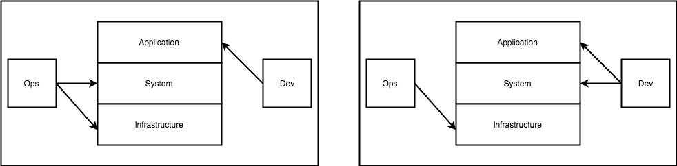
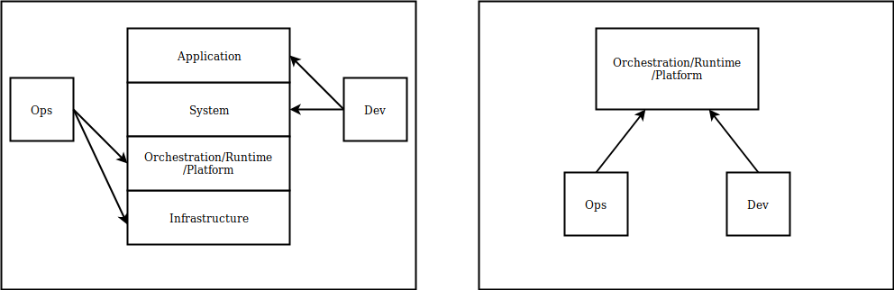
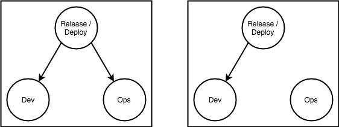
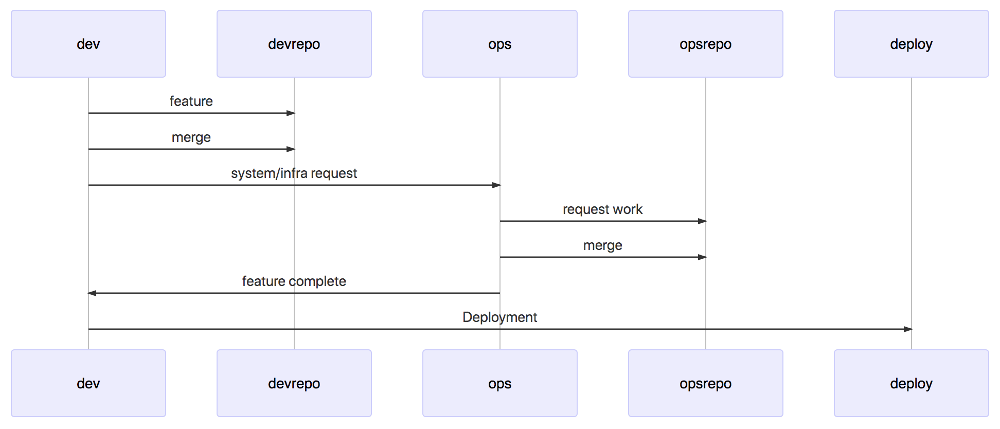
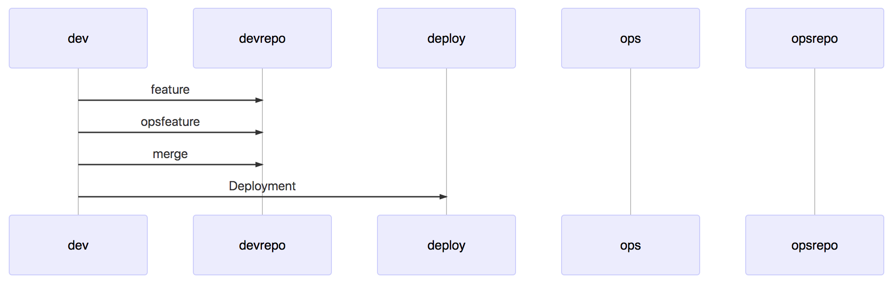
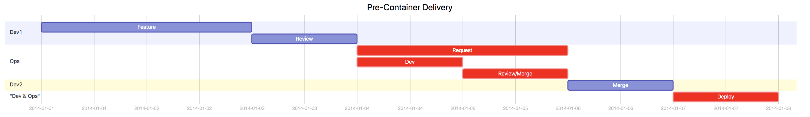
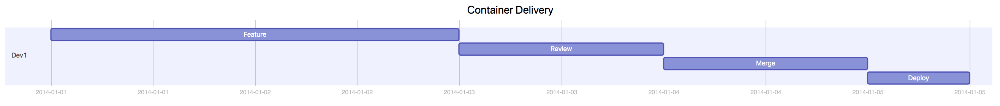

# DevOps: Containers: Velocity Through Reduced Coordination

Containers have a profound impact on software organizational structure by providing a primitive which enables feature teams to fully control their system as well as application level dependencies.  Containers decouple development and operations using a common interface, which can increase velocity by reducing the amount of external coordination required to deliver software.

There are many amazing technical overviews on what [containers are](https://www.freecodecamp.org/news/demystifying-containers-101-a-deep-dive-into-container-technology-for-beginners-d7b60d8511c1/) and how to [use and production-ize them](https://kubernetes.io/docs/concepts/overview/what-is-kubernetes/).  This post focuses on how containers shift the organizational structure and the shift's affect on velocity of delivery. This post assumes knowledge of docker containers and high level knowledge of a Platform or Container Orchestrator (kubernetes, openshift, heroku, etc).

## Decoupling Operations and Development

In many traditional (pre-container) organizations operations (ops) is responsible for both infrastructure (networking, storage, provisioning, etc) and system level resources (filesystem, system libraries such as runtime versions, operating system versions, Shown below on left).  

  

Containers shift this by enabling development (dev) to control [system level dependencies](https://www.freecodecamp.org/news/a-beginner-friendly-introduction-to-containers-vms-and-docker-79a9e3e119b/#container_) (shown on right in above image). The core benefit of containers comes from shifts development one level down the level of software abstraction.

Containers also introduce a new layer of abstraction inserting a new layer the runtime/orchestrator/ or platform bwtwren the infrastructure and the system.  This acts as an interface in the traditional software sends that  decouples the dev and ops.

  

This interface general exposes configuration around cpu memory, environment around number and type , web vs asynchronous queue baes (worker)z of application instance.  Combined with the container primitive which supports controlling application and surface stem leve deenedencirs, these provide
 developers everything they need to ship the majority of features without synchronizing with  ops.  Containers redraw the traditional dependency lines

This simple change has the affect of decoupling operations and development from each deploy, enabling developers to own configuration, system libraries, application, and application configuration:

  

Containers increase velocity by reducing the number of times teams need to coordinate externally in order to deliver software.

## Development/Deployment Overhead

Runtime related are often "DRY" meaning

Configuration management is usually the highest risk, most executed, and most poorly tested.  Having  strict dependency on remote resources makes this difficult and time consuming to execute locally.  

Because of this there are Super long feedback loops on infrastructure changes.

because this is a request that all teams shares the queue can take hours or days

creates a sequence diagrams where the feature team must synchronize with the operations team, which has a significant negative impact on throughput.  The same synchronization is often required during incidents, which leads to the inverse affect on MTTR, prolonging application service outages and degradation.
The case of system, configuration or ops owned deployments create strict dependencies between operations and dev in order to deliver working software to production:

  

  

Separate team is involved with value delivery , involving synchronization and organizational hops.  These teams service multiple development teams and often have their own [queue](QUEUEING THEORY) of work taking hours or days, or potentially longer.

<< FIRST EXAMPLE >>
In this example the overhead is roughly ~30%.  This may seem a lot but I have repeatedly found real life overheads to be around this amount.

IN a containerized world where dev is decoupled from ops and no coordination with ops is not required shows this reduction:

While these examples only focus on delivery there are many similiar beneifits come from ____

These hand offs create a nightmare for delivery accounting, is the feature done when it's handed off? Many organizations have such long deployment loops stories are marked as DONE when they are merged into master and not when they are built and deployed.
Feature Deployment

  

  

What's the fastest conceivable time to explain a system change get someone to look at it? if someones' available it might be 10 minutes, but on the other end I've personally waited (and seen people wait) days. What's your average and median change time when cross team coordination is required? how long? does it take? if a 1 day (8 hour feature has a 2 hour review process that's 25% synchronization overhead)  a 5 day (8hours / day * 5=40 hour)with a 2 hour review process has a 5% overhead.  The reason containers (docker) is so often mentioned with DevOps is because it enforces a strict technical abstraction between teams and ops which isn't [leaky](leak abstraction) (which is referred to as a platform.)  

### Resources
- https://kubernetes.io/docs/concepts/overview/what-is-kubernetes/
- https://www.freecodecamp.org/news/demystifying-containers-101-a-deep-dive-into-container-technology-for-beginners-d7b60d8511c1/
- https://medium.com/dm03514-tech-blog/debugging-devops-using-valuestream-and-lightstep-e1f8e07f4eab
