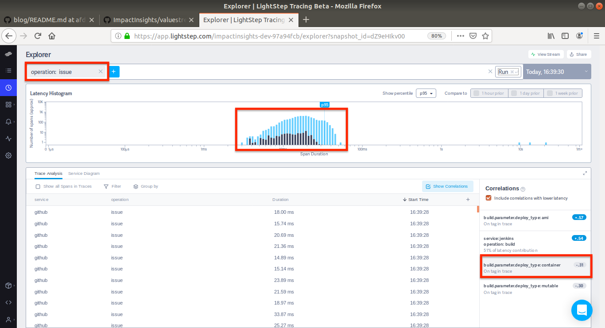

# Debugging DevOps Using ValueStream and LightStep - Root Cause Analysis
The popularity of DevOps has skyrocketed sinceits practices were first outlined in [Continuous Delivery](https://continuousdelivery.com/). Even though it has been nearly 9 years the analysis of DevOps success and efficacy is still dark arts among senior leaders.  ValueStream brings DevOps monitoring up to CloudNative speeds.  This article shows how ValueStream, backed by [LightStep](https://lightstep.com/) can be used to help decision makers debug their delivery pipelines and help them quickly arrive at delivery root-cause hypotheses.

Consider you're working for an organization and you would like to ship faster? How would you go about doing it? How do you visualize and begin to understand and map the delivery process of each team in your org? How do you start to analyze candidates for improvement? Where do you begin to focus your efforts?

This has traditionally been a difficult process. Just building a mental model of delivery for a single team (let alone multiple teams) may involved consulting multiple different systems for metrics, interviews, embedding, inferring metrics through proxies, relying on experience or just plain guessing and experimentation.  ValueStream, backed by LightStep, completely changes this paradigm.  Delivery metrics are stored in a single system providing a uniform view into software delivery (DevOps) performance.

### Background 

This article assumes that Github issues are used to track software work.  For each issue created can generate one or more deployments, and there are 3 deployment types: `container`, `mutable` and `ami`.  

---
NOTE: The data in the examples below was manually generated by submitting Github and Jenkins events to ValueStream. The data is completely valid and representative of the real data that Github and Jenkins webhooks generat with the sole EXCEPTION of the event durations.  Since this was automatically generated the event duration in this tutorial are in milliseconds.  In real life they would most likely be in hours or days.
---

# Issue latency (Lead Time)

ValueStream and LightStep offer a birds eye view of an organizations software delivery system.  This allows seeing a topdown napproach to the amount of time an issue spends open and each major step involved in deliviering the issue:

  

In the issue above the total lead time is represented by the amount of time an issue is open.

Providing the duration of issues are expected of any software production metric system. LightStep really starts to shine for debugging.  [LightStep correlations](https://docs.lightstep.com/docs/correlations) (a built in LightStep feature) is able to analyze what attributes latent operations (issues) have in common. The image below shows and example of LightStep correlations applied to the issue event. LightStep is able to automatically determine the longest issues are much more likely to have ami based builds:
  

  

  

Since tracing maintains a graph of relationships its able to associate events within a trace. in this case deploys are a build event within a trace:

  

The correlations above show the property `build.parameter.deploy_type:ami`.  LightStep is able to associate the issue with a deploy because they model the issue and build as a [Directed Acyclic Graph](https://github.com/opentracing/specification/blob/master/specification.md#the-opentracing-data-model). This allows LightStep to establish a strong relationship between the events in a trace and to leverage properites of events taking place within an Issue in order to provide context into why some issues take longer to complete then others.  In this case ami based builds are present in the longest issues:

  

Imagine how long building a technical inventory and understanding all projects, delivery methods and teams would take.  ValueStream and opentracing (LightStep) has all this information, automatically collected, automatically analyzable in single place.

Inversely LightStep is also able to automatically identify that containerized deploys are associated wiith the shortest issues: 

  

By leverageing webhooks from popular services (Github, Jenkins) and the OpenTracing datamodel, ValueStream is able to collect and surfce metrics in a highly actionable easy to operate way.

# Deploy Failure Practices

This next example will focus on deubgging deployment latencies and errors. This example will start by showing a more "traditional" debugging approach which filters deployments and aggregates them based on their deployment type:

  

The aggregate above shows that failures and latencies are most associated with mutable deployment type. In traditional debugging it's usually the reesponsibility of ann operator to know which aggregates and properties should be used.  Using ValueStream annd Lightstep is able to automatically determine that mutable build are responsible for the most latent builds:

  

This same automatic analysis can be applied when filtering on errors (in this case errored deploys):

  

LightStep is automatically able to determine that failed (errored) builds are more likely to occur during "mutable" type deployments.

-----

ValueStream makes capture issue pull request and jenkins build events trivial.  LightStep enables advanced analysis of the build pipeline.  

### References

- https://medium.com/@dm03514/valuestream-devops-metrics-observing-delivery-across-multiple-systems-7ae76a6e8deb
- https://github.com/ImpactInsights/valuestream
- https://lightstep.com/
- 
