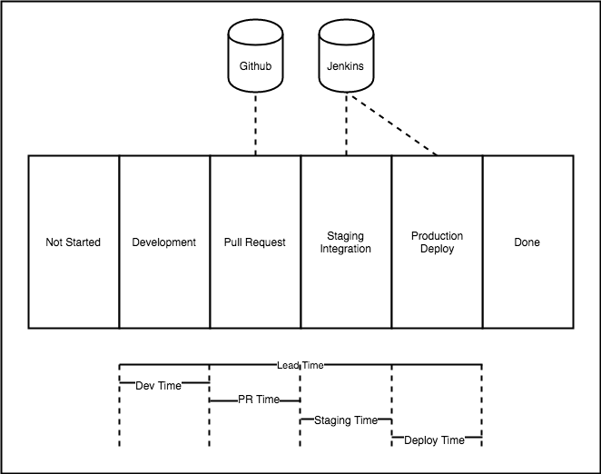

# ValueStream: DevOps Metrics - Observing Delivery Across Multiple Systems

DevOps takes a [holistic approach to value delivery](https://itrevolution.com/the-three-ways-principles-underpinning-devops/) based on reducing feedback loops in order to reduce lead time to increase velocity and the rate of successful software deliveries. Inherent in this are 3 key metrics: Lead Time (latencies) of unit of work as well as each stage in delivery that work, deployment frequency (velocity), and deployment success ratio.  Recently [Accelerate found that measuring these metrics are a cornerstone of high performance teams](https://www.cloudbees.com/blog/2018-accelerate-state-devops-report-identifies-elite-performers). Unfortunately, the current state of the industry in gathering these metrics are often through proxies and vary from company to company.  ValueStream is a project that aims to be a solution to this by providing a single uniform approach application to ease collection of DevOps metrics across all dependencies involved.  This post walks through the current state of the industry, the major issues with the current approaches to gathering DevOps metrics, and how ValueStream can help address these issues.

## Current State

The current state of the industry requires coordination across multiple different software systems in order to take software from idea to production. At the minimum this usually involves: an Issue Tracker, Version Control, and CI/Delivery System.  The process (with each stage) software takes from an idea to running (hopefully providing value) is called a [value-stream](https://en.wikipedia.org/wiki/Value-stream_mapping).  Lead time, (the total time an issue takes from idea to running in production) is a cornerstone metric, as well as the amount of time spent in each stage of the value-stream. (this post considers lead-time as the amount of time a piece of work takes from the start of development until it is successfully deployed to production):

  

Understanding the total time work takes to delivery is just as important as understanding the time spent in each stage of the value-stream.  A top level view of the time the issue takes provide minimal value.  A view of total latency and latency of each stage in a value-stream is critically important to understanding the bottlenecks of the software production processes and where work is queueing.  This allows for queueing theory analysis and theory of constraints to be applied in order to focus on the most latent stages of delivery.  This means that DevOps metrics requires overall latency and also latency of each stage in order to extract meaningful value and observe an organization.  The next step walks through some common approaches to gathering this data.

## Strategies

I've used and observed a number of different approaches that different organizations use to gather DevOps metrics.  This section briefly explores some of the common ones and touches on their downsides.  

### Proxy Through Jira
Proxying stages through Jira usually involves setting up swim lanes to model the value stream.  As teams progress stories from TODO -> DONE the story progresses through the corresponding value stream stage.  This enables team leadership to get metrics into how teams are performing and the latency.

  

The main issue with this approach is that it sacrifices context for centralization.  Since it proxy specific systems data is usually swallowed up.  Consider the case where there is tons of discussion on a Pull Request, or deployment to staging fails 3 times before finally succeeding.  All of that context is missing in this model.  This model is only able to provide a high level coarse grained view of the time spent in each value-stream stage.  Additionally, issue management systems like Jira provide only basic metric analysis; arbitrarily slicing data is often difficult or impossible, and even if it is, missing context from each subsystem makes little data available.

### Adhoc System Integrations

The need for more context in a particular delivery subsystem can lead to creating adhoc integrations with a specific value-stream sub-system.  This may take the form of a custom webhook integration in order to capture metrics, a tool like Jenkins Datadog integration, or a saas like Gitprime which provide detailed github metrics.

  

This strategy is characterized by one off integrations.  It can unlock more context for a specific system but can incur integration maintenance and cost, or significant financial expense in the case of saas like Gitprime.  Finally, while this strategy may offer insights by unlocking additional context data are still split between multiple disparate systems, making it difficult to form a full systems view of an organizations value-stream.

### Adhoc Systems Integration Centralized Store (Data Warehouse)

A centralized store is very similar to the adhoc integrations but provides a central place to put value-stream metrics.  This requires integration code as well as ETL in order to get the systems data into the centralized store.

  

The main issues with centralizing integrations is that they are non-differentiating work that require upkeep, maintenance and monitoring.  This approach also requires potentially large number of integrations (making it much more of a product than simple glue scripts).  Another major issue with this is that the value-stream is not implicitly or explicitly modeled, meaning the relationships between stages are lost.  This makes it impossible to drill into a specific team's experience.  It doesn't easily allow debugging delivery at a team, language(), or any other dimension's) level.

### Anecdotal/Experiential

Another common pattern that I've seen (and had personal success with) is to embed someone familiar with lean/DevOps analysis on feature teams.  It's up to this person to identify what constraints there are by going through the a development/delivery process.  I've had great success with this, by being embedded on teams to understand their challenges and manually map their value stream.  The main issue with this is the amount of time it takes (could take a couple of cycles) and it's not scalable.  

----

## ValueStream: DevOps Metrics

ValueStream is a POC project that centralizes an organizations software delivery metrics, using Distributed tracing as the measurement primitive.  This allows for both a global value-stream view, as well as capturing context from each of the individual systems involved in the value-stream.  It accomplishes this by sitting between each individual service and the OpenTracing ecosystem:

  

The rest of the post explores the actual POC and the data that this type of approach is able to easily generate:

  

By centralizing information from all these systems it’s able to show a high-level view of all the systems and how they’re orchestrated in order to deliver software.  ValueStream shows a top level view in how an org delivers software:

  

The trace above was generated using the working ValueStream POC. The latency is much shorter than real life, but was generated by creating an Github Issue, making a Pull Request that referenced that issue, closing the pull request, firing off a Jenkins build that referenced the issue, executing another Jenkins "deploy" that referenced the issue, and finally closed the Issue in Github.  In addition to providing the top level view it provides rich metrics for each integration.  Anything available in the systems web hook api is able to be set as a tag:

  

The above image shows Github [issue](https://developer.github.com/v3/activity/events/types/#issuesevent) and [pull request](https://developer.github.com/v3/activity/events/types/#pullrequestevent).  

ValueStream's goal is to handle all integrations and non differentiating work by surfacing data using OpenTracing in order to tap into the amazing OpenTracing (jaeger) ecosystem.  This supports drilling into a specific teams delivery performance, as well as dynamically generating a view of an organization's value-stream.

  

The screenshot above shows example of the [build metadata](https://github.com/dm03514/statistics-gatherer-plugin/tree/cf7acd6ba061cec95346f8793ae7b53b2d80963a#build) available in Jenkins integration.

By standardizing on OpenTracing spec and leverage jaeger and Elasticsearch, ValueStream is able to provide things like a "Accelerate" dashboard out of the box.

Standardizing on OpenTracing allows a top level view of each system involved in the value-stream and how they are related but also supports dropping down into any specific stage, all while leverage the awesome open source tracing ecosystem.

Distributed tracing is an excellent candidate for modeling organizational software delivery across multiple disparate systems like jira github and Jenkins Modeling delivery as a distributed trace across multiple different subsystems to be an effective way to operationalize these metrics.

----

I'm extremely interested in any feedback you're willing to provide.  Is this service useful to you? What strategies have you used to collect the "DevOps/Accelerate" Metrics?  Which features would you like to see?

Since data is backed by Elasticsearch it allows ad-hoc high cardinality querying. The example below shows build and Github PR spans inside of Kibana:

  

Since each integration has context rich data in Elasticsearch organizations can answer questions like:
- Whats the average Jenkins deployment time?
- What’s the average Jenkins deployment time by service, team, language, deploy_type, etc
- What’s the average time a pull request is open?
- What’s the average time a pull request is open by repo, team, language, etc.
- Whats the deployment rate? What’s the deployment success ratio?
- What’s the deployment success ratio across deployment types? (Mutable deploy, baked ami, platform etc)

-----

If you're as excited about this as I am, I'm going to be publishing the ValueStream POC and a roadmap shortly, as well as writing more about the technical specifics of this approach, and how the same approach can be applied to capturing detailed, high cardinality, incident information.

Thank you

### References
- https://opentracing.io/docs/overview/
- https://www.jaegertracing.io/docs/1.13/architecture/
