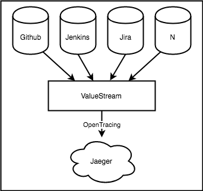

# ValueStream: DevOps Metrics - Observing Delivery Across Multiple Systems

DevOps focus on reducing feedback loops in order to reduce lead time to increase velocity and the rate of successful software deliveries. Inherent in this are 3 key metrics:BLANK.  Recently accelerate found that measuring these metrics are a cornerstone of high performance teams.the way we gather these metrics are often through proxies and vary from company to company.  Gathering delivery data is often the wild west Jeera swim lanes are used as proxies there are gaps some data does not need to be the case this post tracing is an excellent candidate for modeling organizational software delivery across multiple disparate systems like jira github and Jenkins Modeling delivery as a distributed trace across multiple different subsystems to be an effective way to operationalize these metrics.  ValueStream is a project that aims to be a solution to this by providing a single application to ease colleciton of devops metrics across all dependencies invovled.  This post walks through the current state of the industry, the major issues with the current approaches to gathering devops metrics, and how ValueStream can help address these issues.

## Current State

SOftware is developed across many Systems. The minimum usually required are an Issue Tracker, Version Control, and Delivery Sysetm.  

SHOW GRAPH

The process (with each stage) software takes from an idea to running (hopefully providingn vaalue) is called a Valuestream.  Lead time, (the total time an issue takes from idea to running in production) is a cordernerstone metric, and encompasses the total amount of time an item spends from start to delivery:

SHOW GRAPH OF LEADTIME.

Understanding the total time work takes to delivery is just as important as BLANK.  A top level view of the time the issue takes provide minnimal value.  A view of total latency and latency of each stage in a vlaue stream is critically important to understanding the bottlenecks of the software production processes and wherw work is queueing.  This allows for queueing theory analysis and theory of constraints to be applied in order to focus on the most latent stages of delivery.  If you buy into this this means that DevOps metrics requires overal latency and also latency of each stage in order to extract meaningful value and observe an organization.  The next step walks through some common approaches to gathering this data:

## Strategies

### Proxy Through Jira
Proxying stages through jira usually involves setting up swimlanes to model the value stream.  As teams progress stories from TODO -> DONE they mvoe them through the correspopndingn value stream stage.  This enables team leadership to get metrics into how teams are performing and the latency .

  

### Adhoc System Integrations

The need for more context in a particular delivery subsystem can lead to creating adhoc integrations with a system.  This may take the form of a custom webhook integration in order to capture metrics, a tool like Jenkins Datadog integration, or a Saas like gitprime which provide detailed github metrics. 

  

This strategy is characterized by one off integrations.  It can unlock more context for a specific system but can incur integration maainntenence and cost, or significant expense in the case of gitprime.  Finally while this strategy maay offer insights by unlocoking additional conntext data are still split between multiple disparate systems.

### Adhoc Systems Integration Centralized Store

Centralized store is very similiar to the adhoc integrations but provides a single source of truth.  This requires integration code as well as ETL in order to get the systems data into the centnralized store.

  

Main issues with integrations is that they are non-differentiating work that require upkeep, maintenence and monitoring.  In the case of While cenntralized store is able to unlock.  THe major issue with this approach is non-differentiaatingn work and inngestion.  IT also requires pootenntially large number of intnegratios (making it much more of a product than simplpe glue scripts).  Another major issue with this is that the valuestream isn'nt implicitly or explicitly modeled. THe relationships between stages are lost so it because impossible to drill into a specific teams experiennce.

### Anectdotal/Experiential
easy to identify what constraints there are by going through the process a couple of times.  I've had great success with this, by being embedded on teams to undertsand their challenges and manaully map their value stream.  While effective the main issue with this is the amount of time it takes (could take a couple of cycles) and it's not scalable.  Proper DevOps value stream metrics allow for analsysis based on empirical, asynchrnnous data.

----
This is the pattern i've seen of devops measurement lifecycle. 

## ValueStream: DevOps Metrics

ValueStream aims to provide organization with a central point to collect the core devops metrics across all popular software (Jira, Jenkins, Github, Gitlab, Etc, anything with webhook/API support).

By centralizing information from all these systems it’s able to show a high-level view of all the systems and how they’re orchestrated in order to deliver software.  ValueStream shows a top level view in how an org delivers software.  

  

The trace above was generated using the working ValueStream poc. The latency is much shorter than real life, but was gennerated by creating an Github Issue, makign a Pull Request that referenced that issue, closign the pull request, firing off a jenkins build that referenced the issue, firingn off a jenkinsn "deploy" that referennced the issue, and finally closing the Issue as complete.  In addition to providing the top level view it provides rich metrics for each intengration.  AAnythign available in the ysstems webhook api is able to be set as a tag:

  

The above image shows github [issue](https://developer.github.com/v3/activity/events/types/#issuesevent) and [pull request](https://developer.github.com/v3/activity/events/types/#pullrequestevent).  

Value stream aims to handle all integrations and nonn differentiating work and surface data using opentracing in order to tap into the amazing open tracing ecosystem.

  

The screenshot above shows example of the [build metadata](https://github.com/dm03514/statistics-gatherer-plugin/tree/cf7acd6ba061cec95346f8793ae7b53b2d80963a#build) avilable in jenkins integration.

Hi I would love your feedback on a side-project I’ve been working on called ValueStream which is focused on provide “Accelerate” metrics by tying together data from all systems that are part of software production (Jira, Github, Gitlab, Jenkins, Etc).

By standardizinign on OpenTracing spec and leverage jaeger and elastic search, it's able to provide things like a "Accelerate" dashboard out of the box.

Leveraging the Opentracing provides huge benefit, it standardizing the measurment primitive (an opentracing span) and abstracts it to allow for multiple dififerent bakends and implementations.

  

Standardiing on opentracing allows a top level view of each system invovled in the valuestream and how they are related but also supports dropping downn into any specific stage, all while leverage the awesome open source tracing ecosystem.

To make this more conncrete and test ouot the concept I creatdd a POC ValueStream that supports Github Issues, Github Pull Reuqest and Jenkins Build jobs.  

  

I'm extremely interested in any feedback you're willing to provide.  Is this service useful to you? What strategies have you used to collect the "DevOps/Accelerate" Metrics?  Which features would you like to see? 

Thank you

### References
- https://opentracing.io/docs/overview/
- https://www.jaegertracing.io/docs/1.13/architecture/

