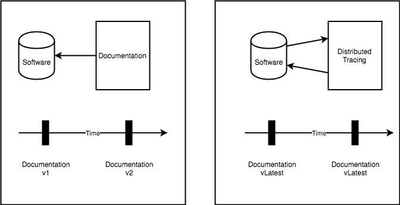
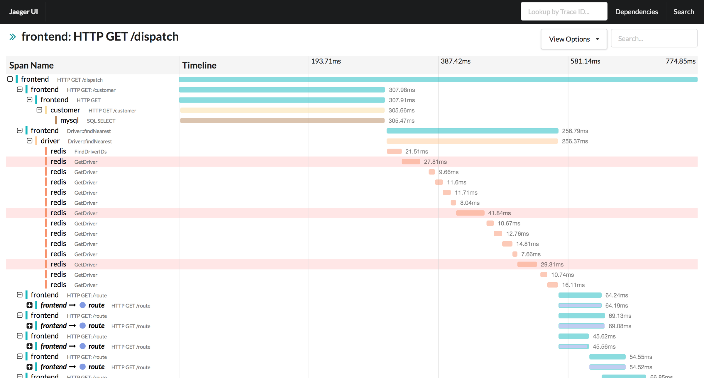
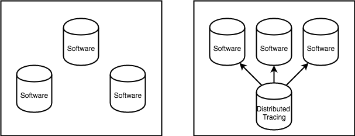
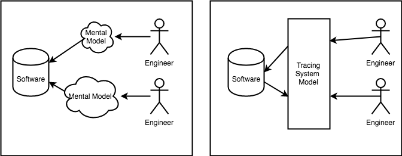
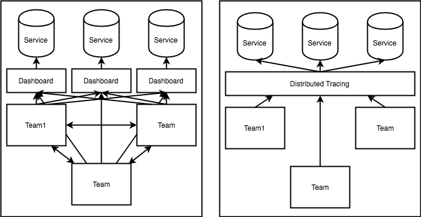
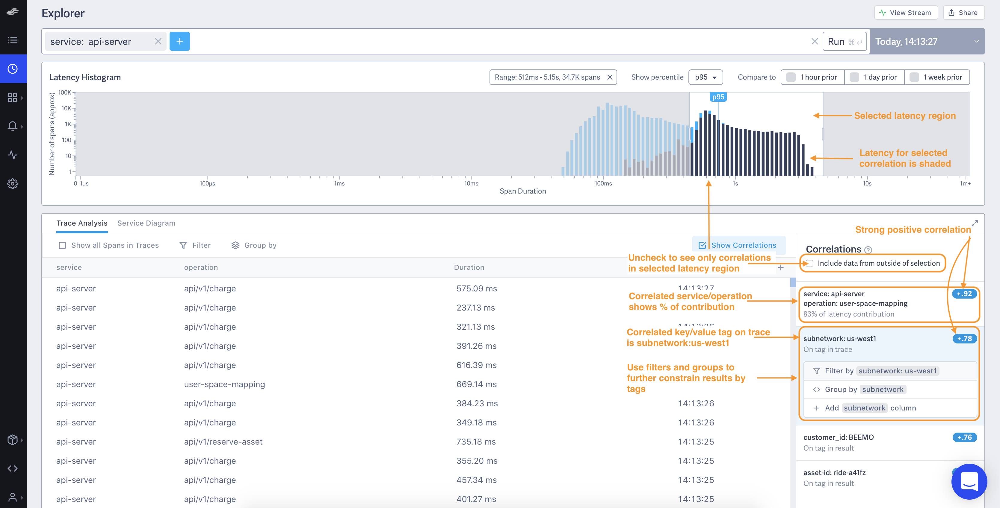

# Distributed Tracing: Impact on Engineering Organizations

[Distributed tracing](https://opentracing.io/docs/overview/what-is-tracing/) tracks actions (transactions) as they travel throughout a system and across multiple subsystems. Distributed tracing provides high cardinality observability which allow for performance tuning and failure analysis.  Due to its ability to dynamically generate real time data, Distributed tracing has a profound impact on engineering Organizations.  This impact comes from the centralization and democratization of information and provides real time, living documentation, architectural knowledge, provides an information layer that removes silos from teams, and provides detailed experience of clients.  Clients.  People, Process, Client.  This post will look at a general journey through onboarding, developing and operating a service and how Distributed tracing positively affects each of these stages.  This post assumes familiarity with distributed tracing (opentracing) data model.

Each of the following benefits are derived from distributed tracing being able to dynamically capture high cardinality metrics.  Distributed tracing democratizes information by providing "living" centralized documentation.

## Onboarding

Distributed tracing benefits onboarding by dynamically generating a real time view of the software system. Source of truth is the source code. Tracing provides a centralized view into the system as it is functioning, including all major services, components, protocols and requests.  Contrast this with documentation, which is traditionally used to capture this information.

### Documentation

Engineer on boarding often involves learning one more more services in depth.  This involves learning where services sit in relation to each other and  understanding specific service transactions.  Hopefully there is some documentation available for the service topology. The largest issues with on boarding is gaining a mental model of the system, transactions and dependencies. Because its manual relatively time consuming to constantly keep architecture up to date documentation is usually out of date (if there is any documentation at all).

Static Documentation is dead documentation, because it is difficult to establish a feedback loop which enforces that it remains up to date.  Because of this documentation is often best effort, and quickly drifts out of date. Tracing on the other hand is captured from reality and is dynamically kept up to date:

<p align="center">
  
</p>

### Topology

Since distributed tracing stores information as a graph (DAG) it becomes possible to dynamically generate service topologies, based on tracing requests (service names):

<p align="center">
  
</p>

The image above is from [Trace by RisingStack](https://trace.risingstack.com/) but all the major tracing platforms offer this functionality. With tracing to see if a service has a dependency on another service, check it's transactions.  With a traditional non-tracing approach the source code would have to be analyzed, or an engineer familiar with the system would have to be consulted.

### Transactions
Another key part of engineer onboarding is learning the key transactions and flows that support client requests. This involves understanding entry points, protocols, collaborators, upstream services.  In traditional onboarding this time intensive.  It requires developing a thorough understanding of software in order to mitigate risk and understanding performance and infrastructure implications of changes.  Once again this is a largely manual process.

All of this information is available dynamically in a centralized place using tracing:

<p align="center">
  
</p>

Without this information getting this info would require tribal knowledge, understanding, or potentially searching repos for where & when dependencies are called within the context of a transaction.  The *worst* case (Which i found to be the *normal* case) is to find this information out from the source of truth, by grepping the code.  With tracing not only is all of this information available but its also possible to narrow in on an individual client's experienced (using tracing tags), something that is much more difficult to develop and understanding of by analyzing source code and tests.

## Developing
Largest benefits development are derived from tracings ability to centralize information:

<p align="center">
  
</p>

The image above shows a non tracing environment, each software service stands alone, and its up to engineers to form mental models of how they interact (and potentially encode those models in tests).  In distributed tracing, the real-life interactions are captured and recorded.  This has profound impact on developing mental models and inventorying the state of the system.

### Mental Models
Without a true representation of the system engineers are forced to establish their own mental models.  Engineers with better mental models end up being disproportionately effective at system understanding then engineers with poorer mental models.  This often manifests as a strict dependency on these experienced engineers during incidents or code reviews, resulting in centralized knowledge and long feedback loops (shown on the left of the image below):

<p align="center">
  
</p>

Distributed tracing, on the other hand, provides an up to date representation of the system.  It is a high fidelity representation of the system and allows for a base system understanding.  Information about the state of the system, collaborators and protocols are available.  Distributed tracing provides an accurate base system model, which democratizes information and enables accessibility to system understanding.

### System/Client Directory

If you're updating a client dependency and want to see all the clients of that how do you do it? Grep Github? hope and pray? backwards compatibility?  Which service are clients of a given service? which versions are those services on of the client library?  Traditionally this information might be available from a metadata store, and if not would have to be queried from source code.  Distributed tracing makes this information accessible through tags.  For example consider the case where a team wants to audit which versions of a client library are being used:

```
db.type=redis
span.kind=client
```

`client.version` would be available for audit.  This benefit is not unique to tracing, but is a property of having information centralized and queryable.

## Operating
Largest benefit around CONTEXT :-> centralization and data modeled.  Better leverage tracing in order to operate, mitigate, detect and respond to failures.

https://medium.com/@copyconstruct/distributed-tracing-weve-been-doing-it-wrong-39fc92a857df

Feedback loops exist at the team level (tribal knowledge) and software level (source of truth)

Incidents may involved many engineers from many teams just to establish a base understanding of what's going on.

Contrast this with tracing which has a cross service and cross team representation of the system.  Any team is able to quickly gain a base context on all services without having to coordinate across teams.  Able to rely on Distributed tracing as a system representation instead of engineers mental models or rooting through the source code.  IF the chart on the left looks complicated, it's because it is.  Think of the last time you were involved in a cross team incident.  Multiple service dashboards, multiple engineers from different services, everyone working together to develop a cross service view of the system and get context around the issue.  Distributed tracing provides a base view of the system that can drastically shorten these feedback loops and number of people involved incidents.  Tracing provides much more context, allowing an on call responder to better understand the system and get farther on their own before involving more people.

SILOED TEAMS FOCUSED ON THEIR services
LONG FEEDBACK LOOPS CROSS TEAMS INVOLVED IN Debugging

<p align="center">
  
</p>


TRACING provides


- On call
- Debugging (Default Hypothesis, Correlations)

<p align="center">
  
</p>


While this is still in its infancy Having operational data centralized this data opens up possibilities for anomaly detection, correlation, and other advanced automated analysis techniques to shorten debugging.  While anomaly detection techniques have been offered by monitoring like DD and New relic they are often focused on single dimension time series. Having centralized store to store all operational data provides access to much more context and significantly increases the impact of anomaly detection .

## Conclusion
Because distributed provides up to date, dynamic "living documentation" which democratizes information within an organization. This provides significant benefits in terms of on boarding documentation, centralized information about a system, and context.  Furthermore modeling systems as graphs allow for accurately modeling system structures.  This post explored the benefits of tracing on a software organization but largely ignores the costs (which are very real).  In my single experience rolling out tracing, the costs are absolutely worth it for the reasons outlined above.


## References

- https://github.com/ExpediaDotCom/adaptive-alerting/wiki
- https://medium.com/opentracing/take-opentracing-for-a-hotrod-ride-f6e3141f7941
- https://docs.lightstep.com/docs/correlations
- https://engineering.salesforce.com/anomaly-detection-in-zipkin-trace-data-87c8a2ded8a1
- https://opentracing.io/docs/overview/what-is-tracing/
