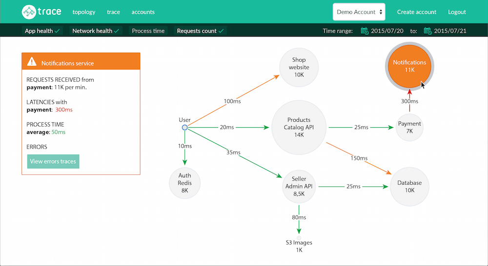

# Distributed Tracing: Impact to Organizational System

[Distributed Tracing](https://opentracing.io/docs/overview/what-is-tracing/) traces actions as they travel throughout a system and across multiple subsystems. Distributed tracing provides high cardinality metrics which allow for performance tuning and failure analysis.  Due to its ability to dynamically generate real time data, Distributed Tracing has a profound impact on a software organization.  This impact comes from the democratization of information and provides real time, living documentation, architectural knowledge, provides an information layer that removes silos from teams, and provides detailed experience of clients.  Clients.  People, Process, Client.

This post will look at a general engineers journey as they are onboarding, developing and operating a service and how Distributed Tracing positively affects each of these stages.  This post assumes familiarity with distributed tracing (opentracing) data model.

Each of the following benefits are derived from distributed tracing being able to dynamically capture high cardinality metrics which include:
- Service communication
- Library versions
- and compares to even the best documentation becoming outdated.

Distributed tracing democratizes information by providing "living" centralized documentation.

## On boarding
Largest beneift from DYNAMICLY generated real time view of the system.

### Documentation
Engineer on boarding often involves learning one more more services in depth.  This involves learning where services sit in relation to each other and  understanding specific service transactions.  Hopefully there is some documentation available for the service topology. The largest issues with on boarding is gaining a mental model of the system, transactions and dependencies. Because its manual relatively time consuming to constantly keep architecture up to date documentation is usually out of date (if there is any documentation at all).

Static Documentation  is dead documentation

DOCUMENTATION GRAPH
NO FEEDBACK LOOP
OUT OF DATE
DOESNN"T REFLECT REALITY
Separate from systems requiring frequent updates, updates aren't enforceable
MISSING FEEDBACK LOOP

### Topology
Dynamically generated based on service name.

Since distributed tracing stores information as a graph (DAG) it becomes trivial to build a dynamic up to date service topology:

  

The image above is from [Trace by RisingStack](https://trace.risingstack.com/) but all the major tracing platforms offer this functionality.  It's essentially free information that is critical for on boarding.

### Transactions
Another key part of engineer on boarding are key transactions and flows involved. This involves understanding entry points, protocols, collaborators, upstream services:

All of this information is available dynamically in a centralized place using tracing:

  

Without this information getting this info would require tribal knowledge, understanding, or potentially searching repos for where & when dependencies are called within the context of a transaction.

The *worst* case (Which i found to be the *normal* case) is to find this information out from the source of truth, by grepping the code.

## Developing
Largest benefits are around centralizing information.

IMAGE SHOWS A CENTRALIZED Store
SHOWS A DISPARATE STORE

### System/Client Directory
If you're updating a client dependency and want to see all the clients of that how do you do it? Grep Github? hope and pray? backwards compatibility?

Which service are clients of a given service? which versions are those services on of the client library?

db.type=redis
span.kind=client

## Operating
Largest benefit around CONTEXT :-> centralization and data modeled

SILOED TEAMS FOCUSED ON THEIR services
LONG FEEDBACK LOOPS CROSS TEAMS INVOLVED IN Debugging

TRACING provides

- On call
- Debugging (Default Hypothesis, Correlations)

## Conclusion
Because distributed provides up to date, dynamic "living documentation" which democratizes information within an organization. This provides significant benefits in terms of on boarding documentation, centralized information about a system, and context.  Furthermore modeling systems as graphs allow for accurately modeling system structures.

## References

- https://medium.com/opentracing/take-opentracing-for-a-hotrod-ride-f6e3141f7941
