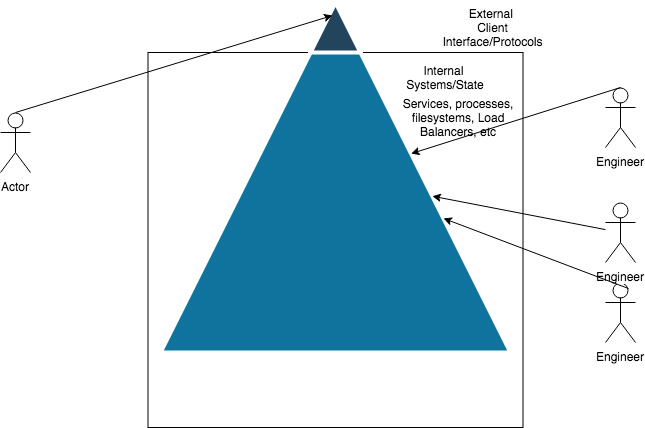

# SRE: Debugging: Getting To Impact

During an incident it is critically important to understand if clients are being affected and to what degree.  This is the most important inflection point in any incident and can be used to guide an appropriate and proportional response.  A client impacting incident necessitates a full and immediate response proportional to the impact, whereas an internal, nonclient impacting incident requires a much lower level response, perhaps not even immediate:

  

This decision exists along two logical dimensions: one representing the client experience and their perception around latencies and their experience around availability.  The second dimension is the internal level, which most engineers operate at.  This level is the level of services, processes and machines, and their orchestrated in order to deliver the client experience:

  

Everything below the client experience is an implementation detail.  **How** isn’t as important as ensuring that the value the client expects to be delivered is actually delivered. There’s two worlds: the client and us. Have you ever felt like the world has been melting that everything is on fire, but have been told in all hands that clients couldn’t be happier? The difficult in incidents is characterizing and reasoning about these two perspectives, and understanding what the actual client impact for any given incident is.  These two perspectives can influence us in unhelpful ways during incidents; as an operator, any unhealthy service or latency is a call for concern.  

[Service Level Objects (SLOs)](https://landing.google.com/sre/sre-book/chapters/service-level-objectives/) are a middle path that help operators and clients communicate.  SLOs can be leveraged to inform the initial impact evaluation and help us understand if clients are being impacted.

To illustrate this imagine that we have a reactive job queue and worker pool that is processing events:

  

The Notification service instances have the following SLO’s around the service it’s providing:

80% Message Processing Availability (ie successfully processed messages / total processed messages > 80%) - Are instances able to send messages for our clients?

99% of messages should be processed in < 1 second (ingested, processed, sent for mailing, and ACKed) - How long are clients waiting for their notification requests to be registered with a gateway?

Choosing which signals to build objectives around and supporting data collection is out of scope of this article and non-trivial. Additionally, these SLO’s may need refinement in terms of definitions, the goal of this article is to illustrate how SLO’s can be used to inform client to non -client.  While the most accurate way to characterize the latency of the service is to generate synthetic transactions as a publishing service, we can create a proxy of the client experience it using notification and queue based metrics.

## Phrasing the impact in terms of client impact

Suppose that alerts for an unhealthy Notification Sender machine begin to fire.  What’s the appropriate response? Start an incident? Risk our reputation? ACK it and wait until morning? Supposing that this is an alert how do we respond and ensure that our response is proportional to the problem?

  

How do we solve for client impact?  

Taking an engineering perspective we may divert resources to immediately figure out what the source of the machine failure is, how it got into that state.  We may start an incident.  Another approach would be to use SLO’s, metrics which proxy the client experience and sit at the top of the client experience to guide the decision making:

  

Consulting our services SLO’s show that we’re able to keep up with amount of work expected (level depth), the quality of work that we’re doing is meeting expectation (> 80% success rate) and the amount of time it takes us to perform that work is acceptable (p99 < 10seconds).

Using SLOs informs the inflection point and allows us to partition up the debug space.  Understanding that the client is not affected by a machine going down or to what degree they are affected allows us to craft a proportional response. A machine in a non-functional, non-malicious state doesn’t even warrant an immediate response in this case.

## Guiding With SLOs

Because SLO’s are so critical for describing the client experience, alerts greatly benefit from being defined in terms of SLOs. HIGH priority alerts should indicate an immediate or impending incident defined in terms of how they affect the client.  [When an alert fires it should be explicit on what the current customer impact is](https://landing.google.com/sre/workbook/chapters/alerting-on-slos/).  Until all teams have explicit SLOs agreed with their Product Managers falling back to SLOs as a first debug step is an effective solution.  SLOs are the critical first step in understanding the client experience and serve as the top level of observability, connecting clients to engineers.  Even though the above notification service example is contrived, using an SLO based response supports aswering: is the service able to perform work for the client? How long is it taking? What is the result of the work?

I would challenge everyone to consider: How can you measure, quantify and alert on the customer experience? For each event: is this a customer impacting event? How can you prove it? SLOs are designed to proxy and quantify the client experience and are able to answer:

**Are clients impacted?**

-----

#### References
- https://landing.google.com/sre/workbook/chapters/alerting-on-slos/
- https://landing.google.com/sre/sre-book/chapters/service-level-objectives/

