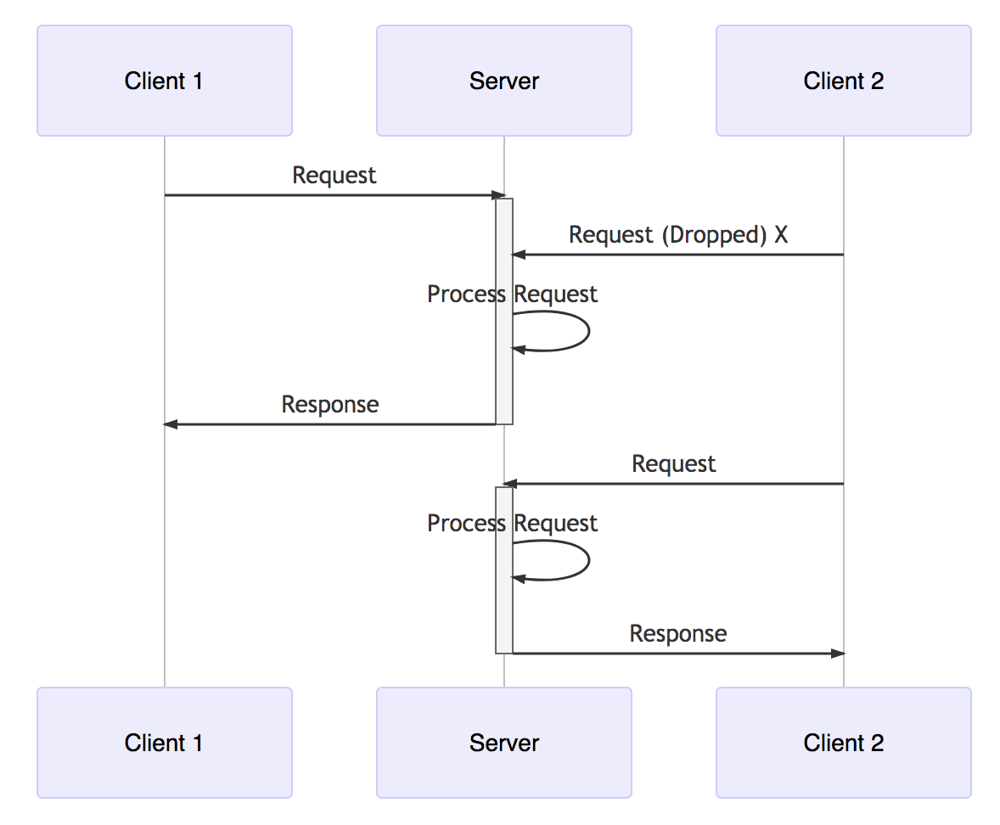
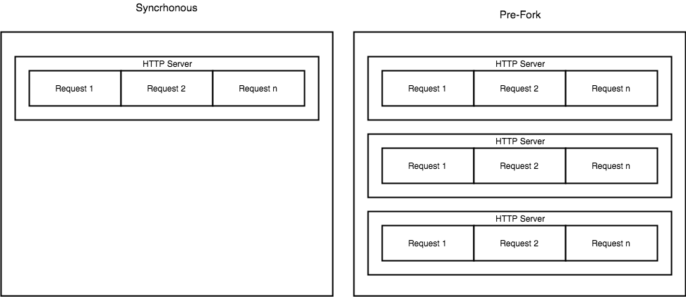
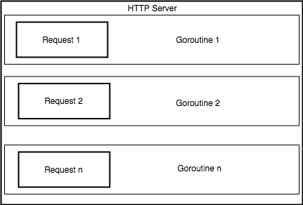

# Golang: Introduction to Race Conditions for the Web Engineer

Go provides a first-class primitive for concurrenncy called a Goroutine. Goroutines allow end users to easily spawn concurrent tasks and synchronize those tasks. Since Goroutines are so foundational to the language most non-trivial programs end up exposing the engineer to concurrent programming.  While go does provide some tools for preventing [race conditions](https://en.wikipedia.org/wiki/Race_condition#Data_race), it is still ultimately up to the end user to verify that their program is safe for concurrent execution ([thread-safe](https://en.wikipedia.org/wiki/Thread_safety)).  This post explains what concurrency is in the context of web programming, what data races are, why they are tricky to detect, and how they can be detected using go's `-race` detector.  At the end of it the reader should understand how to define a data race, how to write a test to exercise a concurrent function and how to analyze the test using the `-race` detector!

## Concurrent Web Service

A concurrent web service (in this case webserver) is able to service a number of client connections at the same time.  For the purposes of this article we are talking about concurrency with regard to the clients.
Go's concurrency model coupled with its built in HTTP frameworks make very compelling for cost effective, performant web services.  This makes it popular with traditional web language communities (ruby, python, php) and creates an environment where many experienced web engineers are thrown into concurrent programming environment, resulting in race conditions and bugs.

In order to illustrate concurrency, consider a web server that is not concurrent.  It accepts a single request processes it until finished and then waits for another request.  If a client makes a request while a current request is in flight they are either dropped or queued.  This is a synchronous system with respect to the clients, meaning it can onnly process a single request at a time:

<p align="center">
  
</p>

Traditional web environments act just like this, but instead of running a single script they start multiple single scripts!  In [Apache](https://httpd.apache.org/docs/2.4/mod/prefork.html) and other environments (unicorn, [uwsgi](https://uwsgi-docs.readthedocs.io/en/latest/WSGIquickstart.html#adding-concurrency-and-monitoring)) this means specifying a number of processes to start (the concurrency level) and then each one of those is able to handle connections as they come in (worker pool).  While this model is easy to reason about an insulates engineers from the complexities of concurrency it does mean that concurrent connections scale linearly with respect to hardware resources (ie processes):

<p align="center">
  
</p>

The image above shows a synchronous service with multiple instances enabling concurrency with respect to clients. One thing that is interesting here is that if the concurrency level is greater than the total number of instances the service becomes saturated (it has reached capacitity because it has more requests than servers able to handle those requests) at which point connections either queue or are dropped.

What we didn't discuss here are asynchronous runtimes like node.js that support multiple concurrent requests but can guarantee that only a single statement executes at any moment removing the possibility of data-races.  In this case concurrency is handled in the runtime instead of from the webserver orchestrating processes.  

## Concurrency In Go

In go, concurrency is achieved through [Goroutines](https://gobyexample.com/goroutines). Goroutines are just normal functions executed concurrently by using the `go` statement!

## Go HTTP concurrency

The builtin [go HTTP](https://golang.org/pkg/net/http/) server [invokes each incoming HTTP request using a Goroutine](https://eli.thegreenplace.net/2019/on-concurrency-in-go-http-servers/#appendix-where-net-http-goes-concurrent).  Concurrency with respect to the client connection is the default which means all HTTP code is concurrent and needs to be safe. 

<p align="center">
  
</p>

## In practice

What this means in practice is close attention needs to be paid whenever shared memory is accessed inside of an http handler (ie goroutine). In order to remove boilerplate and focus on identifying the data race the test below is executing `go func()` directly instead of going through HTTP handlers.  Since HTTP handlers are executed inside of `go` statements this should be equivalent:

```
package main

import (
        "fmt"
        "testing"
)

func Test_RaceCondition(t *testing.T){

        m := make(map[string]string)

        for i := 0; i < 5; i++ {
                go func() {
                        kv := fmt.Sprintf("hi_%d", i)
                        m[kv] = kv
                }()
        }
}
```


### Undefined Behavior
One of the challenges of race conditions are that they result in undefined behavior.  The code below executes the race condition test listed above using 5 goroutines, and it "passes":

```
for i := 0; i < 5; i++ {
```

```
$ go test -run Test_RaceCondition
PASS
ok      github.com/dm03514/test 0.019s
```

This test execution randomly got lucky, for whatever reason there were no interleaving of writes `m[kv] = kv`.  Even though it says `PASS` there is still a race condition.  

Increasing the concurrency to 50 and re-running the test reliably triggers the race condition:

```
$ go test -run Test_RaceCondition
fatal error: concurrent map writes
fatal error: concurrent map writes

goroutine 20 [running]:
runtime.throw(0x113bf62, 0x15)
        /usr/local/Cellar/go/1.12.7/libexec/src/runtime/panic.go:617 +0x72 fp=0xc00003df00 sp=0xc00003ded0 pc=0x102aa32
runtime.mapassign_faststr(0x11112c0, 0xc0000962a0, 0xc0000f0010, 0x4, 0x1)
        /usr/local/Cellar/go/1.12.7/libexec/src/runtime/map_faststr.go:291 +0x40f fp=0xc00003df68 sp=0xc00003df00 pc=0x101138f
github.com/dm03514/test.Test_RaceCondition.func1(0xc0000a0088, 0xc0000962a0)
        /Users/danielmican/go/src/github.com/dm03514/test/main_test.go:15 +0xbd fp=0xc00003dfd0 sp=0xc00003df68 pc=0x10f0d9d
runtime.goexit()
        /usr/local/Cellar/go/1.12.7/libexec/src/runtime/asm_amd64.s:1337 +0x1 fp=0xc00003dfd8 sp=0xc00003dfd0 pc=0x10570a1
created by github.com/dm03514/test.Test_RaceCondition
        /Users/danielmican/go/src/github.com/dm03514/test/main_test.go:13 +0x6e

...

goroutine 67 [runnable]:
github.com/dm03514/test.Test_RaceCondition.func1(0xc0000a0088, 0xc0000962a0)
        /Users/danielmican/go/src/github.com/dm03514/test/main_test.go:13
created by github.com/dm03514/test.Test_RaceCondition
        /Users/danielmican/go/src/github.com/dm03514/test/main_test.go:13 +0x6e

goroutine 23 [running]:
runtime.throw(0x113bf62, 0x15)
        /usr/local/Cellar/go/1.12.7/libexec/src/runtime/panic.go:617 +0x72 fp=0xc00003f700 sp=0xc00003f6d0 pc=0x102aa32
runtime.mapassign_faststr(0x11112c0, 0xc0000962a0, 0xc0000180b8, 0x5, 0x1)
        /usr/local/Cellar/go/1.12.7/libexec/src/runtime/map_faststr.go:291 +0x40f fp=0xc00003f768 sp=0xc00003f700 pc=0x101138f
github.com/dm03514/test.Test_RaceCondition.func1(0xc0000a0088, 0xc0000962a0)
        /Users/danielmican/go/src/github.com/dm03514/test/main_test.go:15 +0xbd fp=0xc00003f7d0 sp=0xc00003f768 pc=0x10f0d9d
runtime.goexit()
        /usr/local/Cellar/go/1.12.7/libexec/src/runtime/asm_amd64.s:1337 +0x1 fp=0xc00003f7d8 sp=0xc00003f7d0 pc=0x10570a1
created by github.com/dm03514/test.Test_RaceCondition
        /Users/danielmican/go/src/github.com/dm03514/test/main_test.go:13 +0x6e
exit status 2
FAIL    github.com/dm03514/test 1.017s
```

### Race detector
Go provides a built in tool called the race dector that helps to identify race conditions.  While `-race` should be used it can result in false negatives because it needs to observe concurrent accesses. For example, if a test suite passed in `-race` flag but doesn't spawn go routines than there's nothing the race detector can do.  In the case of the race condition above the race detector works perfectly.  Even at 5 concurrent requests its able to detect the race condition:

```
for i := 0; i < 5; i++ {
```

```
$ go test -run Test_RaceCondition -race
==================
WARNING: DATA RACE
Read at 0x00c00001a160 by goroutine 7:
  github.com/dm03514/test.Test_RaceCondition.func1()
      /Users/danielmican/go/src/github.com/dm03514/test/main_test.go:14 +0x3c

Previous write at 0x00c00001a160 by goroutine 6:
  github.com/dm03514/test.Test_RaceCondition()
      /Users/danielmican/go/src/github.com/dm03514/test/main_test.go:12 +0xb8
  testing.tRunner()
      /usr/local/Cellar/go/1.12.7/libexec/src/testing/testing.go:865 +0x163

Goroutine 7 (running) created at:
  github.com/dm03514/test.Test_RaceCondition()
      /Users/danielmican/go/src/github.com/dm03514/test/main_test.go:13 +0x94
  testing.tRunner()
      /usr/local/Cellar/go/1.12.7/libexec/src/testing/testing.go:865 +0x163

Goroutine 6 (running) created at:
  testing.(*T).Run()
      /usr/local/Cellar/go/1.12.7/libexec/src/testing/testing.go:916 +0x65a
  testing.runTests.func1()
      /usr/local/Cellar/go/1.12.7/libexec/src/testing/testing.go:1157 +0xa8
  testing.tRunner()
      /usr/local/Cellar/go/1.12.7/libexec/src/testing/testing.go:865 +0x163
  testing.runTests()
      /usr/local/Cellar/go/1.12.7/libexec/src/testing/testing.go:1155 +0x523
  testing.(*M).Run()
      /usr/local/Cellar/go/1.12.7/libexec/src/testing/testing.go:1072 +0x2eb
  main.main()
      _testmain.go:42 +0x222
==================
==================
WARNING: DATA RACE
Write at 0x00c000086330 by goroutine 9:
  runtime.mapassign_faststr()
      /usr/local/Cellar/go/1.12.7/libexec/src/runtime/map_faststr.go:202 +0x0
  github.com/dm03514/test.Test_RaceCondition.func1()
      /Users/danielmican/go/src/github.com/dm03514/test/main_test.go:15 +0xd8

Previous write at 0x00c000086330 by goroutine 7:
  runtime.mapassign_faststr()
      /usr/local/Cellar/go/1.12.7/libexec/src/runtime/map_faststr.go:202 +0x0
  github.com/dm03514/test.Test_RaceCondition.func1()
      /Users/danielmican/go/src/github.com/dm03514/test/main_test.go:15 +0xd8

Goroutine 9 (running) created at:
  github.com/dm03514/test.Test_RaceCondition()
      /Users/danielmican/go/src/github.com/dm03514/test/main_test.go:13 +0x94
  testing.tRunner()
      /usr/local/Cellar/go/1.12.7/libexec/src/testing/testing.go:865 +0x163

Goroutine 7 (finished) created at:
  github.com/dm03514/test.Test_RaceCondition()
      /Users/danielmican/go/src/github.com/dm03514/test/main_test.go:13 +0x94
  testing.tRunner()
      /usr/local/Cellar/go/1.12.7/libexec/src/testing/testing.go:865 +0x163
==================
--- FAIL: Test_RaceCondition (0.00s)
    testing.go:809: race detected during execution of test
FAIL
exit status 1
FAIL    github.com/dm03514/test 0.535s
```

Whereas previously the test could pass with 5 concurrency from random bad luck, the race detector is able to record the accesses to the shared memory and see that those accesses are coming from 2 separate go routines!

### Fixing the Data Race

The final step is to fix the Data race.  One way of doing this is to use primitives (mutex) to ensure that only a single goroutine is able to write to the map at a time.  

```
package main

import (
        "fmt"
        "testing"
        "sync"
)

func Test_RaceCondition(t *testing.T){
        m := make(map[string]string)
        mu := sync.Mutex{}


        for i := 0; i < 500; i++ {
                go func() {
                        kv := fmt.Sprintf("hi_%d", i)
                        mu.Lock()
                        m[kv] = kv
                        mu.Unlock()
                }()
        }
}
```

```
$ go test -run Test_RaceCondition
PASS
ok      github.com/dm03514/test 1.755s
```

Even at 500! concurrency the code is now safe because it guarantees that no concurrent accesses can be performed on the map.


## Conclusion

Go exposes concurrency as a first class citizen and makes it dead simple to use.  This comes at the cost of reasoning about concurrent correctness and data races.  On top of this, many of the popular web environments, have runtimes and deployment models that remove the need.  Careful consideration must be given to concurrent memory accesses and shared memory when programming in go.  It's critically important to understanding: "Will this code be executing concurrently?" and if so "Is this code thread-safe"?  Once this is understood go provides great testing utilities (`-race`) to help gain confidence in concurrent correctness.  In addition to `-race` I have also had a ton of success detecting race conditions using a Structured analysis technique named [`Candidates & Contexts`](https://medium.com/dm03514-tech-blog/golang-candidates-and-contexts-a-heuristic-approach-to-race-condition-detection-e2b230e70d08#0783).
