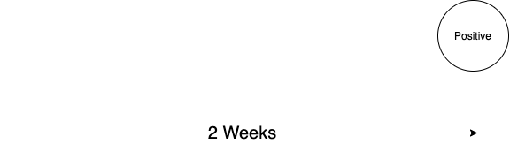
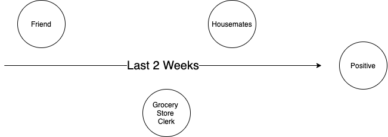
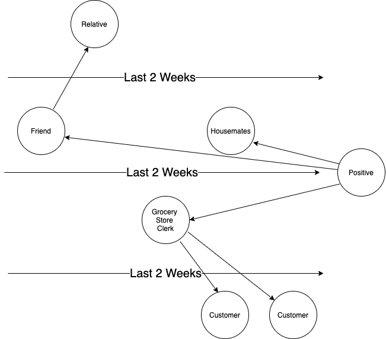
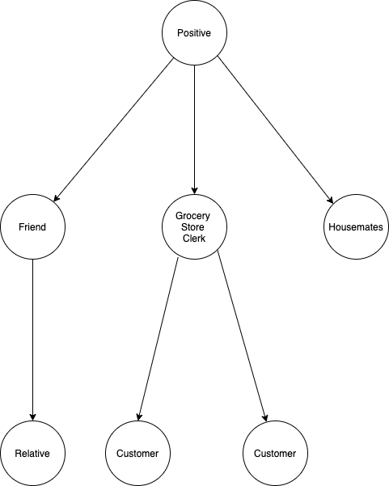

# What Is Contact Tracing, and Why It's Essential To Reopen

Contact tracing is a technique to determine everyone that an individual came into contact with during some period of time. It's important to identify people who were potentially exposed to a sick individual so that they can self isolate until sickness incubation period has passed. Using contact tracing it's possible to significantly reduce the spread of disease. As soon as an individual tests positive for a sickness they can apply contact tracing to identify and alert people that they came in contact with to self isolate.

# Identification

Consider an individual who tests posiitive for coronavirus:

  

Contact Listing is the first step of tracing. The individual lists everyone that they came into contact with in the last 2 weeks: 

- Spouse
- Children
- Friend 
- Grocery Store Clerk

Which looks like: 

  

These people are referred to as the "first degree" contacts, because its just the people that the positive person came into contact with.

# Trace Each Person Traced

What about the people that the first degree dependencies came into contact with? What about the relatives of the friend that was visited? Or the customers the grocery store clerk interacted with after they were exposed? These are referred to as the "second degree" contacts:

  

The trace should go until every single person that could have possibly come into contact with the positive person be identified. This could go many levels deeper (the "n-th degree" contacts). Another way to visualize this is as a tree. The positive person is on top, and then each person they came into contact with is below them, and each person those people came into contact with are below them, and so on until every single person is identified:

  

This example stops at 2nd degree contacts, but you could imagine how the bottom contacts are traced to include their contacts. If we were able to accurately identify every single person that was exposed and isolate them, we would be able to keep the spread at bay and reopen the economy.

# Problems with Contact Tracing

The biggest problem with contact tracing is that it relies on people's memory.  "Where were you on thursday and who did you talk to?" "Who did you come into contact with at the supermarket?", "What was their name?". You see it's very difficult to idenetify every single person.

# Why We Need an Automated Solution

An automated solution is necessary because it's the only way to accurately trace every single person someone came into contact with, and every person they came into contact with, etc. A phone based solution would be able to keep track of thi automatically. As soon as one person test postive every single person in the chain could be alerted instantaneously so that they could start isolation.

# Why an Independent Non-Profit Needs To Own This Solution

It's essential that an independent publicly funded organization operate and maintain this. The information required by tracing could be invaluable to an advertising company, government or big tech. The success of tracing needs to be aligned with public health and not with coorporate profits or survaillance. Imagine a [Let's Encrypt](https://letsencrypt.org/) for contact tracing.

