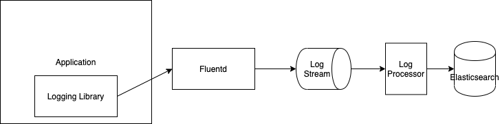

# Scaling Logging: JSON's Not Enough

JSON is the de-facto logging standard. JSON is so ubiquitous that the popular logging data tools (such as Elasticsearch) accept JSON by default. Although JSON is an evolution over previous logging standards, JSON's lack of strict types make it insufficient to use for long-term persistence or as a foundation for a data-lake. This post describes the problem with JSON and proposes a solution using a strictly typed interchange format such as Protocol Buffers.

# The Trouble With JSON

JSON logs establish an explicit structure. JSON parsers are available in most languages which make it accessible as a log standard. JSON logs are referred to as "structured" logging. When applications log as JSON it means that they emit fully formed JSON to their log sinks. Common sinks are standard out/error, files, syslog etc. These sinks are commonly connected to a daemon such as flunetd which routes the logs to long-term storage such as S3 or Elasticsearch.

The application emits JSON through its logging library. An example could look like:

```
{
    message: "an important event",
    client_id: 1,
    timestamp: "2019-02-04T12:23:34Z",
    pid: 12121,
    http: {
        request: {
            path: "/some-path"
        }
    }
}
```

Structured logging is a solution to address the previous era of logs, which are referred to as "unstructured". Unstructured logs are commonly logged as a single line and requires custom parsers for each different log, commonly regex. Examples of unstructured logs are webserver access logs. This is an example of a default apache log line:

```
127.0.0.1 - peter [9/Feb/2017:10:34:12 -0700] "GET /sample-image.png HTTP/2" 200 1479
```

Parsing this log may require a different solution than parsing an nginx vs varnish vs haproxy vs etc. Clients of unstructured logs need N separate parsing methods, one for each log type. A client of JSON needs a single parser for all logs. A JSON consumer using python can parse *any* structured log using the same implementation:

```
import json

log = json.loads(log_line)
```

Unfortunately, parsing is one of many steps in making logs unusable. Logs need to be transformed, aggregated, validated, and stored/loaded. JSON has multiple properties which make it a poor candidate as a logging protocol.

## Unenforceable structure

Even though JSON is more structured than a text line, JSON does not encode the full structure. This makes logs "schema-on-read". Applications can send any JSON log, but it's the readers responsibility to parse and use that log. And it's not until reading the log that the schema (the full structure of the log) is used. Consider an application that logs:

```
{
    http: {
        request: {
            path: '/test'
        }
    }
}
```

A consumer that counts paths:

```
import json

paths = collections.defaultdict(int)

log = json.loads(log_line)
paths[log['http']['request]['path']] += 1
```

With schema on read the structure is only important to the reader of the data. There is no feedback on the writer. The application logging the JSON can log anything and it's up to the consumer of that data to apply a "schema". The full structure only becomes important when the log is read.

Consider what happens when another upstream application logs a different format:

```
{
    http: {
        request: 'http://www.test.com/test'
    }
}
```

This log breaks the log consumer! The burden of consuming this log falls on the consumer! What often happens is the consumer is updated to accommodate this new log format:

```
import json
from urllib.parse import urlparse

paths = collections.defaultdict(int)

log = json.loads(log_line)

try:
    paths[log['http']['request]['path']] += 1
except KeyError:
    u = urlparse(log['http']['request'])
    paths[u.path] += 1
```

Schema on read becomes unmanageable as the number of producers increases. Imagine if there were 5 different structures? 10? 50? In large organizations and/or microservices, one team may be responsible for log ingestion but many teams are responsible for log production. Even with shared tooling such as logging libraries it's still possible to produce a variety logs due to the lack of feedback (missing schema-on-write) on the producer side.

## Unknown types

Not only is the structure not known until read but the data types are not known either. Consider 3 different log producers:


```
# producer 1
{
    age: 1
}
```

```
# producer 2
{
    age: '1'
}
```

```
# producer 3
{
    age: null 
}
```

Even though the structure of each log is the same, the data types change. The consumer needs to account for different structure and different datatypes because of schema on read.

## Feedback loops

Schema on read creates very long feedback loops for log producers. It's not until the data is read by a downstream consumers validates whether the schema is valid and the usability of the log. Consider a common logging architecture:

<p align="center">
  
</p>

In this setup:

- The application logs to syslog or a file
- fluentd reads from that file or stdout
- Fluentd sends the logs to a log stream
- The logs are processed from the log stream and are put in Elasticsearch

This log isn't validated until the consumer tries to use it, due to schema on read. This means that the engineer developing the application sends what they think is a valid log but doesn't get feedback on its validity later in the log stream. How does an engineer know if their log is failing? Where do they go to figure it out? How do they observe fluentd? The stream? The stream consumer? Elasticsearch. JSON logs using schema on read are difficult to debug.

# Schema on Write

An explicit schema combined with schema on write must be used in order to make log consumption sane. The technologies commonly used for explicit data schemas are:

- Protocol Buffers
- Avro
- Thrift

The rest of this article will focus on Protocol Buffers. Protocol Buffers requires defining a schema and generating a language specific bindings for that schema. An example log schema may look like:

```
syntax = "proto3";

package log;

message Log {
  required string message = 1;   
  required string level = 2;   
}
```

A language specific binding needs to be created for each log producer. Afterwards the log producer can generate a protobuf Log object and then serialize that object. The producer receives feedback on the log, structure and types during serialization. Explicit schemas move logs from schema on read to schema on write!

The consumer needs a reference to the Log message using the python specific language binding, which is generated using [Protocol Buffer standard library](https://developers.google.com/protocol-buffers/docs/pythontutorial). Afterwards, python can parse the log line directly to a `Log` message.

```
from google.protobuf.json_format import Parse

import log_pb3

log = log_pb3.Log()

Parse(log_line, log)

# log.message
# log.level
```
Protocol Buffer provides a fully validated log structure and strict field types!

## Wire Protocols 

Protocol Buffers ship with their own binary serialization format. Most Protocol Buffer client libraries (python, node, go, etc) support serializing and deserializing between json and Protocol Buffers. This means they can parse a JSON message into a Protocol Buffer, and output JSON from a Protocol Buffer. This reduces the friction involved in introducing Protocol Buffers into a JSON logging pipeline. 

# Conclusion

JSON and schema on read are not sufficient for building multi service log processing systems. JSON's lack of explicit structure leads to complexity for the log consumers. An explicit schema such as Protocol Buffers, which supports schema on write can address JSON's issues. Protocol Buffers enable fast feedback for clients on the validity of logs and provides consumers with the full object structure and datatypes of the log, before consuming. These properties are especially important for data lakes where raw logs may be materialized into multiple different systems for consumption. Without an explicit schema JSON quickly becomes untenable for these use cases.


## Links
- https://medium.com/dm03514-tech-blog/scaling-services-explicit-data-contracts-using-protocol-buffers-5ce7041347e6

--- 
# Outline
- Intro
    - JSON - defacto
    - Missing explicit types
    - Explicit schema using a technology like Protocol Buffers
- The trouble with JSON
    - Structure vs Unstructured
    - not untyped
        - No regex
    - Feedback loops
    - Schema on Read vs Write
- Strict Types
    - Protocol Buffers to the rescue 
    - Strict types
    - Cross language bindings
    - Wire protocols
    - Feedback loops
    - Schema on write
    - Aggregation
    - Downstream services 
- Conclusion
