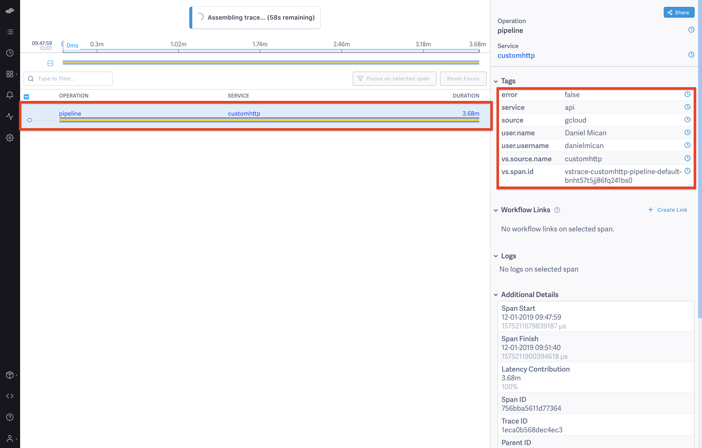
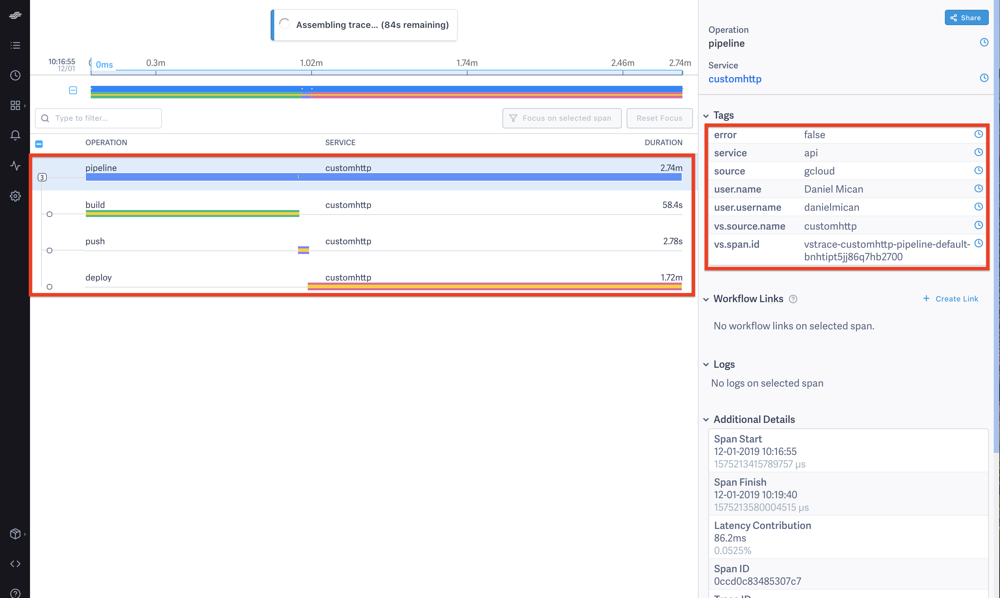

# Debugging DevOps: Instrumenting Local Deployments

We know we shouldn't be performing actions locally but since they aren't resulting in errors or huge incidents addressing it often pushed off.  At ValueStream, we beleive the first step to making sustainable changes to any system is understanding the elements of the system and their connections.  This is especially important for human centric systems like DevOps.  This post shows how ValueStream can be used to start monitoring local actions with very low effort.  This allows organizations to treat these important local actions as the first class citizens they are, monitor their performance and build an inventory of locally executed operations.  This post will walk through instrumenting the ValueStream deployment script to emit detailed metrics around local deploys.

<p align="right" width="300">
  
</p>


## Problem

Local deploys are common place in many startups.  Processes that start on small teams that don't want to invest in cloud deployments are inherted as companies scales.  Because of this there may be some critical production tasks that.  Local Deploys seem to be one of those action items that no one is super comfortable with but is rarely prioritized enough to fix it,  always living at the end of the backlog.  Executing actions locally means that audit information is missed, who, when, why were deploys taking place, in the case of DevOps metrics, how often, how long, and what's the error rate, and how much time the deploy is adding to a work item's overall lead time.

## Example

### Tracking Events

Here at ValueStream we deploy to production locally using google cloud SDK, the rest of this post shows how all it takes is a couple of minutes using ValueStream to begin tracking any local scripts.

This post illustrates how ValueStream can be used to monitor local depoloys using ValueStream's own production deployment process as an example.  For background ValueStream is hosted in Google Cloud and uses Goolge App engine to host its production infrasturucture.  The deployment process is executed daily and requires the following steps:

- Builds a [Docker Image](https://docs.docker.com/v17.09/engine/userguide/storagedriver/imagesandcontainers/#images-and-layers)
- Pushes to [Google Container Registry](https://cloud.google.com/container-registry/)
- Issues a deploy using `gcloud` tool

A simple bash script is used to accomplish this:

```
# deploy-api.sh

docker build -f Dockerfile.api -t valuestream-api .

docker tag valuestream-api us.gcr.io/value-stream/valuestream-api
docker push us.gcr.io/value-stream/valuestream-api

gcloud app deploy \
    --image-url us.gcr.io/value-stream/valuestream-api devops/gae/app.api.yaml \
    --version=v1 \
    --quiet
```

While this is easy there's no visibility audit log or history.  We deploy 1-2 times a day, is this a good candidate to improve? How long are we spending in the deploy? What's the success rate? Basically as it stands now there's no visibility or answers to these common DevOps and delivery questions.

```
TRACEID="$(vscli event -tag='source|gcloud' -tag='service|api' -type=pipeline start)"

...

vscli event -type=pipeline end -event-id=${TRACEID}
```

(Images Below shows Traces in LightStep; ValueStream OSS can output to Jaeger and LightStep, and ValueStream cloud beta will only ship to LightStep, requiring a free LightStep account to use LINK):

<p align="center">
  
</p>

The trace above shows the duration of the trace and all associated tags.  LightStep enables grouping traces by any tags, comparing durations to past intervals, and seeing aggregates of event rates, latency distributions and error rates.  
In two lines of code we've started to track something that only a single engineer was experieincce, and are able to surface that up to a centralized location where it can be inventoried and benchmarked. 

### Pipeline Traces

While extremely useful for debugging DevOps, ValueStream's real power comes from being able to model processes.  The deployment script has 3 different logical steps:
- Build 
- Push
- Deploy

ValueStream is intelligentlly able to connect these.  Using the `vscli` tool to do this looks like:

```
#!/bin/bash

TRACEID="$(vscli event -tag='source|gcloud' -tag='service|api' -type=pipeline start)"

BUILD_TRACEID="$(vscli event -type=build -tag='type|docker' start -parent-event-id=vstrace-customhttp-pipeline-default-${TRACEID})"
    docker build -f Dockerfile.api -t valuestream-api .
vscli event -type=build end -event-id=${BUILD_TRACEID}

PUSH_TRACEID="$(vscli event -type=push -tag='type|docker' start -parent-event-id=vstrace-customhttp-pipeline-default-${TRACEID})"
    docker tag valuestream-api us.gcr.io/value-stream/valuestream-api
    docker push us.gcr.io/value-stream/valuestream-api
vscli event -type=push end -event-id=${PUSH_TRACEID}

DEPLOY_TRACEID="$(vscli event -type=deploy -tag='type|gae' start -parent-event-id=vstrace-customhttp-pipeline-default-${TRACEID})"
    gcloud app deploy \
        --image-url us.gcr.io/value-stream/valuestream-api devops/gae/app.api.yaml \
        --version=v1 \
        --quiet
vscli event -type=deploy end -event-id=${DEPLOY_TRACEID}

vscli event -type=pipeline end -event-id=${TRACEID}
```

Many tools naturally have this format, where work is in many different states, and the duration of each state is important:

- JIRA story moving across swimlanes
- Build Pipelines, Jenkins, Gitlab, Local, etc
- Team Working on multiple issues or repos towards completeing an Epic 

Executing the script again shows the updated instrumentation:

<p align="center">
  
</p>

Modeling this as a pipeline captures each stage of the deploy and its parent.  In other words it maintains causaility.  It accomplishes this by storing the actions as a Graph (DAG).  Modeling events as a DAG enable advanced metrics and ___
[Combined with LightStep can be used to intellegintly debug delivery across multiple different tools, teams, or processes](https://medium.com/valuestream-by-operational-analytics-inc/debugging-devops-using-valuestream-and-lightstep-e1f8e07f4eab).

This allows you to filtered for commonly errored or latent transactions and then instantly have context on why, are there shared technologies?

## Conclusion

ValueStream offers no-friction instrumentation for local scripts and processes.  ValueStream OpenSource is currently available on GitHub and ValueStream Cloud will be opening up its Beta laater this month.  We would love to you hear your comments and feedback! Thank you.

### References
- [ValueStream Cloud](https://www.value-stream.net/home)
- [ValueStream OpenSource](https://github.com/ImpactInsights/valuestream)
- [Debugging DevOps using ValueStream and Lightstep](https://medium.com/valuestream-by-operational-analytics-inc/debugging-devops-using-valuestream-and-lightstep-e1f8e07f4eab)
- https://cloud.google.com/developers/startups/
- [LightStep Free Account](https://lightstep.com/pricing/)

