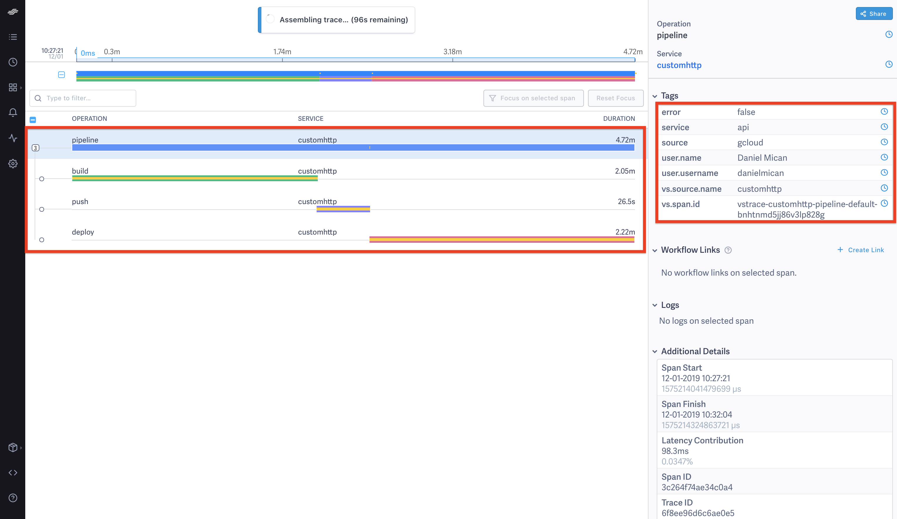

# DevOps Observability: Instrumenting Local Deployments


Have you ever deployed to production from your local machine? We know we shouldn't be deploying from our local machines locally but since they aren't resulting in errors or huge incidents addressing it often pushed off.  At ValueStream, we believe the first step to making sustainable changes to any system is understanding the elements of the system and their connections.  This is especially important for human centric systems like DevOps, where it's difficult to inventory and monitor all the different teams, processes and performance across them. 

This post shows how ValueStream can be used to start monitoring local deploys with minimal effort.  This allows organizations to treat these important local actions as the first class citizens they are, monitor their performance and build an inventory of locally executed operations.  This post will instrument ValueStream's actual production deployment script in order to capture detailed build and deploy metrics.

<p align="center">
  
</p>

## Problem

Local, CLI based, deploys are common in many startups.  Processes that start on small teams that don't want to invest in cloud deployments are inherited as companies grow.  Executing actions locally means that audit information is missed, who, when, why were deploys taking place, in the case of DevOps metrics, how often, how long, and what's the error rate, and how much time the deploy is adding to a work item's overall lead time.  It's difficult to improve what isn't even known about. ValueStream aims to provide zero friction observability tools to enable organizations to inventory and measure their DevOps and deployment processes.

## Example

Here at ValueStream we deploy to production locally using google cloud SDK, the rest of this post shows how all it takes is a couple of minutes using ValueStream to begin tracking any local scripts.  ValueStream focuses on providing metrics at two separate levels:

- [Events](https://github.com/ImpactInsights/valuestream/wiki/Events#event-types)
- Traces

**Events** represent individual actions at a point in time:

<p align="center">
  
</p>

They are often expressed as an aggregate over time and are often used to gain a coarse level understanding of a system performance.  They are important signals for monitoring any system and usually take the form of: Throughput, Latency, Error Rate and Saturation.  These are so common that Google refers to them as the ["Four Golden Signals"](https://landing.google.com/sre/sre-book/chapters/monitoring-distributed-systems/#xref_monitoring_golden-signals).  

**Traces** connect events together by establishing causality between events. 

<p align="center">
  
</p>

ValueStream uses a standard called [OpenTracing](https://opentracing.io/docs/overview/) in order to model the relationship between events.  Traces are ValueStream's special sauce and allow ValueStream to model complex DevOps and development processes with minimal effort, all that's required is to pass an identifier for an instrumented action that refers to one or more parent actions.  Tracing is becoming extremely popular in distributed systems for the detailed insight it can provide about processes. ValueStream makes this detailed analysis accessible to managers, director, DevOps engineers, and anyone else responsible for organizational performance.

### Tracking Events

As background, ValueStream Cloud is hosted in [Google Cloud](https://startup.google.com/) and uses Google App Engine to host its production infrastructure.  The deployment process is executed daily and requires the following steps:

- Builds a [Docker Image](https://docs.docker.com/v17.09/engine/userguide/storagedriver/imagesandcontainers/#images-and-layers)
- Pushes to [Google Container Registry](https://cloud.google.com/container-registry/)
- Issues a deploy using `gcloud` tool

A simple bash script is used to make the deploy:

```
# deploy-api.sh

docker build -f Dockerfile.api -t valuestream-api .

docker tag valuestream-api us.gcr.io/value-stream/valuestream-api
docker push us.gcr.io/value-stream/valuestream-api

gcloud app deploy \
    --image-url us.gcr.io/value-stream/valuestream-api \
    devops/gae/app.api.yaml \
    --version=v1 \
    --quiet
```

While this is easy there's no visibility audit log or history.  We deploy 1-2 times a day, is this a good candidate to improve? How long are we spending in the deploy? What's the success rate? Basically as it stands now there's no visibility or answers to these common DevOps and delivery questions.  ValueStream ships with a "Custom HTTP" Event source which supports user submitted (ad-hoc events).  Below shows the `deploy-api.sh` script instrumented to capture deploy durations:

```
TRACEID="$(vscli event -tag='source|gcloud' -tag='service|api' -type=pipeline start)"

...

vscli event -type=pipeline end -event-id=${TRACEID}
```

(Images Below shows Traces in LightStep; ValueStream OSS can output to Jaeger and LightStep, and ValueStream Cloud Beta will only ship with LightStep support as a metric store, [requiring a free LightStep account in order to use](https://lightstep.com/pricing/)):

<p align="center">
  
</p>

The trace above shows the duration of the trace and all associated tags.  LightStep enables grouping traces by tag, comparing durations to past intervals, and seeing aggregates of event rates, latency distributions and error rates.  In two lines of code we've started to track something that only a single engineer was experiencing and are now able to surface that up to a centralized location where it can be inventoried and benchmarked. 

### Pipeline Traces

While extremely useful for debugging DevOps, ValueStream's real power comes from being able to model processes through traces.  The deployment script has 3 different logical steps:
- Build 
- Push
- Deploy

ValueStream is able to connect each of these stages by providing a reference to the parent event for each of the children events.  Using the `vscli` tool to do this looks like:

```
#!/bin/bash

TRACEID="$(vscli event -tag='source|gcloud' -tag='service|api' -type=pipeline start)"

BUILD_TRACEID="$(vscli event -type=build -tag='type|docker' start -parent-event-id=vstrace-customhttp-pipeline-default-${TRACEID})"
    docker build -f Dockerfile.api -t valuestream-api .
vscli event -type=build end -event-id=${BUILD_TRACEID}

PUSH_TRACEID="$(vscli event -type=push -tag='type|docker' start -parent-event-id=vstrace-customhttp-pipeline-default-${TRACEID})"
    docker tag valuestream-api us.gcr.io/value-stream/valuestream-api
    docker push us.gcr.io/value-stream/valuestream-api
vscli event -type=push end -event-id=${PUSH_TRACEID}

DEPLOY_TRACEID="$(vscli event -type=deploy -tag='type|gae' start -parent-event-id=vstrace-customhttp-pipeline-default-${TRACEID})"
    gcloud app deploy \
        --image-url us.gcr.io/value-stream/valuestream-api \
        devops/gae/app.api.yaml \
        --version=v1 \
        --quiet
vscli event -type=deploy end -event-id=${DEPLOY_TRACEID}

vscli event -type=pipeline end -event-id=${TRACEID}
```

Most processes are naturally expressed as a pipeline:

- JIRA story moving across swimlanes
- Build Pipelines, Jenkins, Gitlab, Local, etc
- Team Working on multiple issues or repos towards completeing an Epic 

Executing the script again shows the updated instrumentation:

<p align="center">
  
</p>

The above image is able to capture how much time is spent in each state of the deploy.  Modeling this as a trace captures each stage of the deploy and its parent.  In other words it maintains causaility. ValueStream will be able to track causaility all the way up to the epic level, allowing organizations to have a complete view into all work that is requried in order to ship software.  Modeling events as a DAG also enables a number of advanced analyses, which when 
[combined with LightStep can be used to intelligently debug delivery across multiple different tools, teams, or processes](https://medium.com/valuestream-by-operational-analytics-inc/debugging-devops-using-valuestream-and-lightstep-e1f8e07f4eab).

The image below shows the time when a cached image is used:

<p align="center">
  
</p>

## Conclusion

ValueStream offers no-friction instrumentation for local scripts and processes.  If you would like to gain visibility into your DevOps processes, ValueStream OpenSource is currently available on GitHub and ValueStream Cloud will be offering a free tier for its Beta release later this month.  We would love to you hear your comments and feedback! Thank you.

### References
- [ValueStream Cloud](https://www.value-stream.net/home)
- [ValueStream OpenSource](https://github.com/ImpactInsights/valuestream)
- [Debugging DevOps using ValueStream and Lightstep](https://medium.com/valuestream-by-operational-analytics-inc/debugging-devops-using-valuestream-and-lightstep-e1f8e07f4eab)
- https://cloud.google.com/developers/startups/
- [LightStep Free Account](https://lightstep.com/pricing/)

