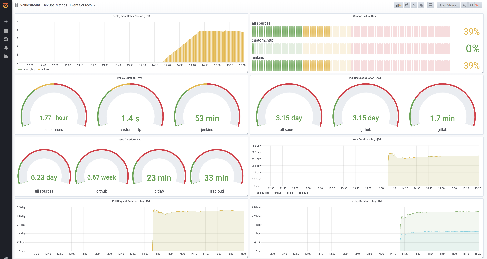

# ValueStream: DevOps OpenCensus Metrics & Grafana Dashboard! 

ValueStream now supports exporting metrics to Prometheus as well as Jaeger/ElasticSearch!  ValueStream provides DevOps and Software Engineering metrics in a free easy to operate service and we're excited to announce support for Prometheus through OpenCensus.  We're also shipping a grafana dashboard to allow teams to begin to consume these critical metrics and get a pulse on organizational deployment performance.

  

--- 

Drop us a line ([@OpAnValueStream](https://twitter.com/OpAnValuestream)) if you’d like help getting started or do you have in an integration request.  We'd love to hear feedback!