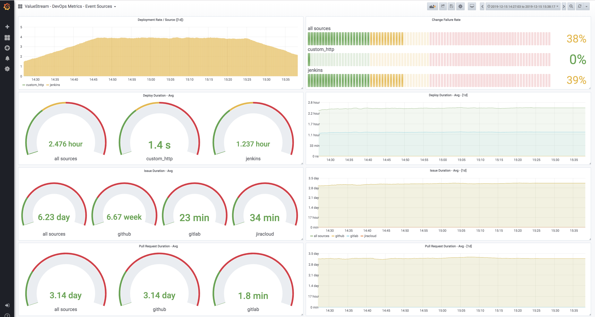
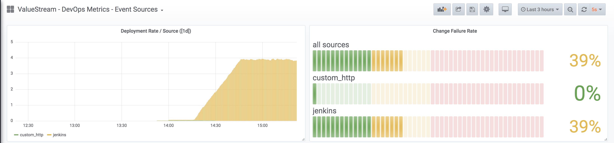
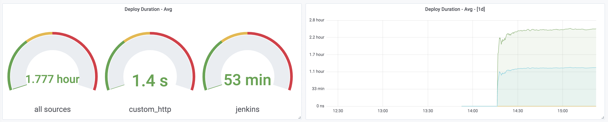
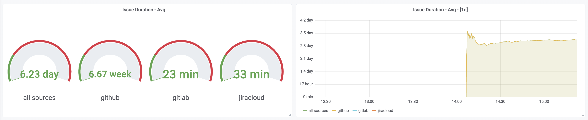
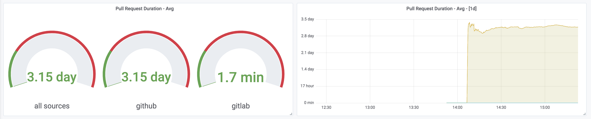

# ValueStream: DevOps OpenCensus Metrics & Grafana Dashboard! 

ValueStream now supports exporting metrics to Prometheus as well as [Jaeger/ElasticSearch](https://www.jaegertracing.io/docs/1.11/)!  [ValueStream](https://github.com/ImpactInsights/valuestream) provides [DevOps](https://cloud.google.com/blog/products/devops-sre/the-2019-accelerate-state-of-devops-elite-performance-productivity-and-scaling) and Software Engineering metrics in a free easy to operate service and we're excited to announce support for Prometheus through [OpenCensus](https://opencensus.io/exporters/supported-exporters/go/).  We're also shipping a grafana dashboard to allow teams to begin to consume these critical metrics and get a pulse on organizational deployment performance.

  

This post describes the structure of the dashboard, and the [event metrics](https://github.com/ImpactInsights/valuestream/wiki/Events#event-types) included. In later posts we'll cover each one of these metrics in depth.  

## Deployment Rates & Results
Deployments are the conerstone to delivery.  This is why they are featured as the first item. If the end goal is delighting customers and creating amazing experiences for them, deployments are how orgs make that into a reality:

  

The upper left hand graph shows the deployment rate by datasource, and in aggregate.  This answers "How frequently are deploys happening?", and "By Which Datasources?".  The Deployment success ratio is another strong indicator of operational flakiness and general maturity. High failure rate is a strong indicator of operational instability, and jeopardizes smoothly deliverying to customers.  This can answer "How often are deployments failing in the given interval?", and "By which datasources are they failing?".

## Deployment Durations
The length of deployments are another indicator of operational maturity.  Long deployment times often cause backpressure to an organization which can cause batching of deploys in order to reduce the total time spent in deployment.  For many organizations, deployments are often a "hands-on" action, meaning that an engineer is manually executing and monitoring the deployment and rollout. Deployment duration is a great candidate for automation and improvement and often directly correlates with saved time.  This helps to make it very easy to calculate ROI on deployment initiatives and ValueStream helps to show the affect of that over time:

  

On the left hand side is the quick view of delivery durations over the interval by event source. The right side shows a timeseries view over the interval. 

## Issue Duration
If deployments indicate, issues represent the conceptual and physical tasks to creating the value to be delivered.  Long issue durations are a strong indicator of scope of work and performance.  Issue durations are used to proxy the Accelerate "Lead Time" metric.  When Issues are closed after a deployment is made they are a full indicator of the total time it takes from starting a unit of work until it is delivered to customers.  It encpossass time spent in design, developemnt, review and deployment, making this an extremely important indicator of performance:

  

On the left hand side is the quick view of issue durations over the interval by event source. The right side shows a timeseries view over the interval. 

## Pull Request Duration

Pull Requests are a unit of code (changeset) to be reviewed. Code reviews are essential to measure because they are an often expensive synchronization point for multiple teams with in organization. Long code reviews can indicate expensive cross team initiatives, complicated technologies, technical debt or cultural and prioritization issues.  Pull Request duration is essential to monitor because they are a common bottle in software delivery:

  

On the left hand side is the quick view of pull request durations over the interval by event source. The right side shows a timeseries view over the interval. 

# Conclusion

We've found the above metrics to be critical delivery and software production metrics.  Our goal for ValueStream is to provide free world class tooling to help origanizations to increase their software production efficiency, and are excited to be able to offer out of the box Grafana dashboard! In later posts we'll explore how to use these metrics to debug delivery and some of the common issues (and their fixes) that these metrics surface.

--- 

Drop us a line ([@OpAnValueStream](https://twitter.com/OpAnValuestream)) if you’d like help getting started or do you have in an integration request.  We'd love to hear feedback!
