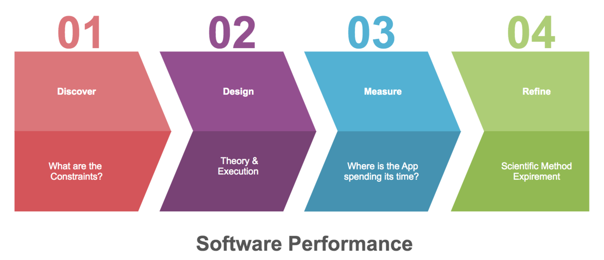

# Software Performancce Tuning: Discover, Design, Measure & Refine

Software performance tuning is often regarded as a dark art for low level hackers.  In my experiences the majority of performance tuning is much more social and systems based, opposed to low level Brendan Gregg low level OS wizardry.  This post outlines an approach to software performance which incorporates performance into the very beginning of the software development lifecycle. 

# What is Software Performance? And Why Should We Care?
Software performance is an overloaded term and can be used to mean a number of things:
- Responsiveness (latency)
- Stability (availability)
- -ilities (scalability, extensibility, maintainability, extensibility)

Without refining the defition yet, we should care because software performance:

- Impacts Customer Experience
- Informs Scaling & Provisioning
- Indicates Performance Regressions (relative changes)

  

## What's the Problem?

Performance is (unfortunately) Emergent, meaning that individual systems performance may not inform the larger systems performance when they are combined.  Even if this is not strictly 100% true, it's difficult to predict the performance of end user system when system is put together.  This has 2 important implications:

- Difficult to predict performance (Favor Observation)
- System Specific (Local Doesn’t Predict Remote)

Because of this, we often see the mantra: Make it Work then Make it Fast emerge.  This suggests that we shouldn't worry about performance until we have a working project.  While I think this is better advice than the other end of the spectrum, there is plenty of low overhead work we can do to design performance in.

## Finally! Performance is:

Defined by clients, and a proxy for their experience!  Perofrmance is the executable validation of a design.  Performance will happen either Explicitly, under our control and guidance or Implicity, hitting against unforseen user expectations or unforseen physical limitations (such as the speed of light).

# How do we ensure Code is Performant?

  

# Discover
What are the known or discoverable constraints?  

## Explicit Constraints
These will often be viewed from a client's perspective.  These are often contractual ie a customer is paying for a certain level of service:

- Response must be served with 100ms
- 99.99% of requests need to be < 1 second

The two most common sources for these are:

- Contractual
- Product Management

## Implicit Constraints

Implicit constraints are performance limits hidden in requirements. If a program is doing *daily* reports or *hourly* rollups, the interval of those actions may defined the expected limit. These are constraints that are often end user usability experience (UX) focused. For example if an action is blocking in the user path there is a [~100ms limit for the site to feel "responsive"](https://www.nngroup.com/articles/powers-of-10-time-scales-in-ux/).

## Physical Limitations of Systems

Physical limitations are often dictated by the minimum achievable performance in the physical world! If certain latencies are required between largely separated locations performance will run up against the speed of light!  There are other performance critical constraints based on the current speed of hardware, seen in the ["Latency Numbers Every Programmer Shold Know"](https://gist.github.com/hellerbarde/2843375) infogram:

  

## Reasonable Ranges

Reasonable ranges are formed based on knowledge of physical system limitations 
