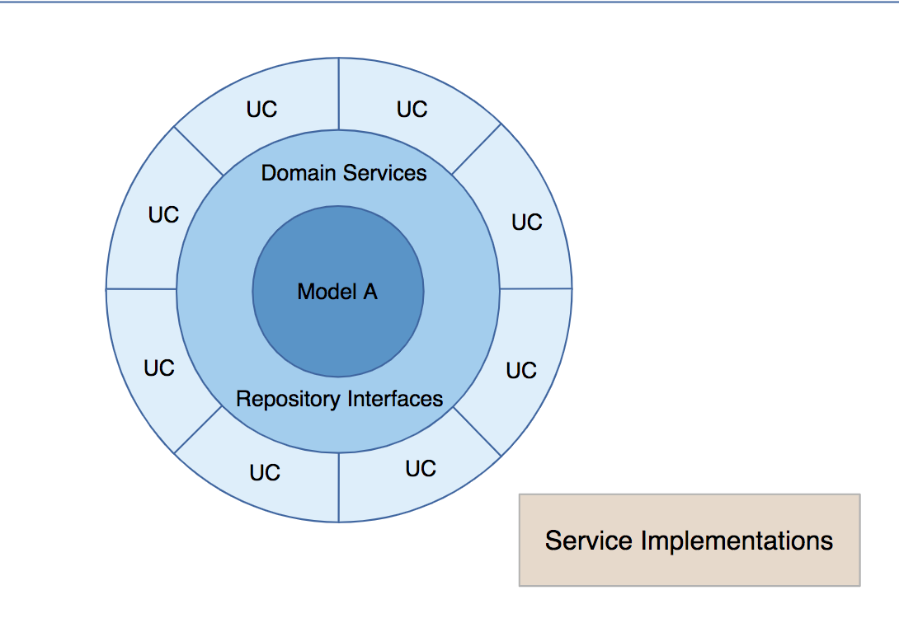
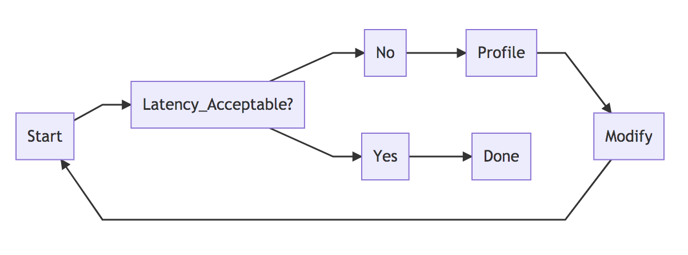
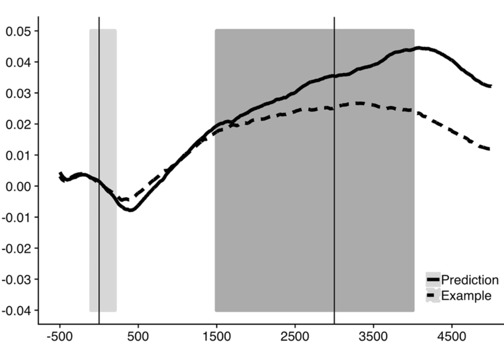
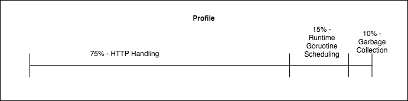
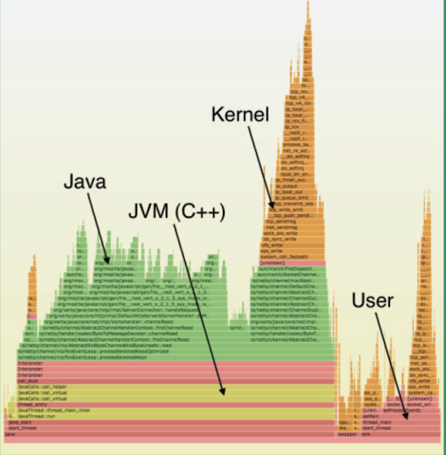

# Software Performancce Tuning: Discover, Design, Measure & Refine

Software performance tuning is often regarded as a dark art for low level hackers.  In my experiences the majority of performance tuning is much more social and systems based, opposed to low level Brendan Gregg low level OS wizardry.  This post outlines an approach to software performance which incorporates performance into the very beginning of the software development lifecycle. This post was adapted from an internal talk.

# What is Software Performance? And Why Should We Care?
Software performance is an overloaded term and can be used to mean a number of things:
- Responsiveness (latency)
- Stability (availability)
- -ilities (scalability, extensibility, maintainability, extensibility)

Without refining the defition yet, we should care because software performance:

- Impacts Customer Experience
- Informs Scaling & Provisioning
- Indicates Performance Regressions (relative changes)

  

## What's the Problem?

Performance is (unfortunately) Emergent, meaning that individual systems performance may not inform the larger systems performance when they are combined.  Even if this is not strictly 100% true, it's difficult to predict the performance of end user system when system is put together.  This has 2 important implications:

- Difficult to predict performance (Favor Observation)
- System Specific (Local Doesn’t Predict Remote)

Because of this, we often see the mantra: Make it Work then Make it Fast emerge.  This suggests that we shouldn't worry about performance until we have a working project.  While I think this is better advice than the other end of the spectrum, there is plenty of low overhead work we can do to design performance in.

## Finally! Performance is:

Defined by clients, and a proxy for their experience!  Perofrmance is the executable validation of a design.  Performance will happen either Explicitly, under our control and guidance or Implicity, hitting against unforseen user expectations or unforseen physical limitations (such as the speed of light).

# How do we ensure Code is Performant?

  

# Discover
What are the known or discoverable constraints?  

## Explicit Constraints
These will often be viewed from a client's perspective.  These are often contractual ie a customer is paying for a certain level of service:

- Response must be served with 100ms
- 99.99% of requests need to be < 1 second

The two most common sources for these are:

- Contractual
- Product Management

## Implicit Constraints

Implicit constraints are performance limits hidden in requirements. If a program is doing *daily* reports or *hourly* rollups, the interval of those actions may defined the expected limit. These are constraints that are often end user usability experience (UX) focused. For example if an action is blocking in the user path there is a [~100ms limit for the site to feel "responsive"](https://www.nngroup.com/articles/powers-of-10-time-scales-in-ux/).

## Physical Limitations of Systems

Physical limitations are often dictated by the minimum achievable performance in the physical world! If certain latencies are required between largely separated locations performance will run up against the speed of light!  There are other performance critical constraints based on the current speed of hardware, seen in the ["Latency Numbers Every Programmer Shold Know"](https://gist.github.com/hellerbarde/2843375) infogram:

  

## Reasonable Ranges

Reasonable ranges are formed based on knowledge of physical system limitations and experience of observing systems in production.  Suppose that there is a go service that accepts and HTTP connection, makes a get request to redis and then writes and closes the HTTP connection.  The service is being tested locally by running both the service and redis and driving traffic using apache benchmark.  Locally is a 2019 macbook pro  with 6 core and 16GB of ram.  On the first test the service is only able to handle 50 requests per second!  Based on experiences this is unreasonable.  This service should be able to push a couple hundred requests per second easy.

  

# Design

Design phase is focused on materializing the structure of a concrete implementation.  This is where discovered constraints are combined with implementation strategies.  Most of the performance work shold be done here, as this is where the solution is most maleable and has the least cost associated with changing.

## Measurement Strategy

First step is to define a measuring strategy:  

- **What** is being measured?
- **Where** is it being measured?
- **How** will it be collected?

And finally what will we use to determine if this is “performant”?  [Google's strategies for choosing good SLOs highly align with this step](https://cloud.google.com/blog/products/gcp/building-good-slos-cre-life-lessons).

## Theoretical Performance

Theoretical Design takes into account theoretical performance and runtime complexity of implementation algorithms and datastructures:

  

It also includes system specific implications of performance, like implications of schema choices on database query execution.

## Isolatable Components - Testable Design

This brings us to the code level.  There are a number of techniques that reduce [friction in isolating components](https://medium.com/dm03514-tech-blog/you-are-going-to-need-it-using-interfaces-and-dependency-injection-to-future-proof-your-designs-2cf6f58db192) for inidividual benchmarks and in providing stub (highly controllable) implementations for performance testing:

- Interfaces & Swappable Implementations
- Dependency Injection
- Exercise components in isolation using test harness
- Ability bring up and exercise the service using test load

  

# Measurement

## Strategies

Using the mesurements defined above its time to start determining if performance has been "achieved"!  Since this methodology puts client experience as first priority if performance meets the clients expectations then no more tuning is necessary:

  

## Execution : Generate Load

Many different ways to load a system.  Best to start with the higher level (customer representative metrics) and slowly work down into implementation details as more data becomes available.  Many different test types:

- Performance
  - Local (relative) vs Remote in a Prod-like environment (absolute)
- Soak/Endurance/Stress
- Remote Long running, verifies steady state
- Canarying
- Service Test Harness
- Micro benchmarks (such as [go Benchmark](https://golang.org/pkg/testing/#hdr-Benchmarks))

## Establish Baseline

Establishing baseline is crucial for seeing relative change in performance.  Without a baseline it's difficult to understand the impact of a change:

  

## Profile
Profiling is used to determine where an application is spending its time or other resources (ie memory).  

  

## Visualize!

Once data is captured it's important to put it in a form that can be easily understood.  A common profile visiualization technique is called Flame Graphs and was created by Brendan Gregg:

  

A detailed description on how it can be used to understand application [performance can be found on the acmqueue article here.](https://queue.acm.org/detail.cfm?id=2927301)

([Image belongs to Brendan Gregg and was Published on acmqueue](https://queue.acm.org/detail.cfm?id=2927301))

# Refine