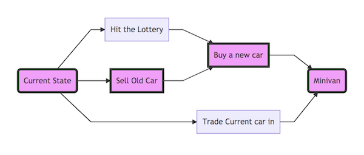

# Visions, Projects & Priorities: Using Temporal Graphs to Build Your Own Reality

There's a huge problem in business right now.  The best prioritizers, decision makers, visionaries, and "shapers" use their abilities to disproportionately benefit themselves.  Deciding "what's next" is the most difficult part of leadership. There are very few resources on making good mid and long term decisions, weighing decisions for priority and optimizing complex decision options.  Without long term vision and structured approach to creating a reality companies are prone to fall into making decisions based on local optima: "What's the best move right now" or making decisions optimized around short delivery intervals: "What's the highest value thing to do in this interval".  Both of these disregard long term visions, the sorts of visions that .  This post explores the concept of temporal graphs and how they can be used to reason about reality and construct timelines in order to reason about long term initiatives.

## Temporal graphs

Temporal Graphs with respect to business and reality are ways to reason about causality.  Every action made creates new actions.  Have you ever read a choose your own adventure book? Most pages are left with a choice, and each choice either opens up the possibility to make more choices or lose choices.

Consider a case where you had an option to walk to work ~30 minutes, or drive to work ~20 minutes unless you hit traffic.  You choose to drive because you worked out extra hard last night.

  

In the walk scenario getting delayed from traffic is a near impossibility.  There are an almost infinite other ways to get delayed but traffic is minimal.

At every moment in time there are a near infinite number of choices to make, and looking back over all choices that we made creates a path through a near infinite graph that we call our life.

Where we are are a result of the decisions that we made and the decisions that other people make, and random luck.  Successful projects and successful businesses also can be traced through a series of decisions that were made, that were given and random lucky events.

## End States

End States are critical at the top level of business and projects for success, it's unrealistic to hope to succeed as a by product of random luck or favorable events from other people.  Because of this, leaders need to have clear end states and be able to convey those end states, and execute to those states.  Leader in this case is anyone with a stake at moving the company to a different state (ie anyone responsible for changing the company).

We'll walk through an example of how end states can be used.

Let's pretend I have a growing family and I determine there's a need for a mini-van.

  

Current state single vehicle to -> Minivan

## Intermediary states

Intermediary states are a series of causal events that can transform the current state into the desired state.  At the highest level these are logical events and are notable events in the transformation of the current state to the desired.

  

Each one of these states lead to the end goal. The level of abstraction here is intentionally high level. For vision and roadmap the level.  It only needs specific enough to clearly convey the thought process and explain and convince others how the current state can be transformed into the desired state.

## Levels of intermediary states (Abstraction)

### Logical Strategy

What we've been talking about up until this point is the Logical strategy.  Logical strategy is a list of causal states that leads from one state to another but intentionally avoids getting too detailed.

  

### Execution Strategy

Execution strategy is something that can be decomposed and handed out to people to begin to execute.  

  

### Day to day (Executable) Strategy

This can break down until the concrete actions required.  The next level might involved specifying the steps necessary to "Prepare the car".  Vacuum car, schedule detailer, fix muffler.  "List on website" may involve: Create an account, take photos, and List.  

## Goals

If you have goals you can’t expect to reach your goals with out putting constructing itching events that we eventually we didn’t consider the goal of boarding if this is a go for you and your future speaking another language you’re getting in shape during the precursors to him making this a reality need to have a decision

Temporal Graphs are helpful at showing how actions lead to outcomes.  One common thing I see are that teams or individuals, Adopting a new technology or tool, learning a new language, saving for vacation.

  

Without concrete actions outlined to arrive at the desired end state (the goal) connecting with the current state there is no path to the goal.

Hoping to learn a new language without or make a vacation a reality without saving are missing all the intermediary states.

## Exploration Breadth First

Establishing a vision may involve some steps that are unknown or need to be discovered.  

The goal is to open up favorable situations

There are many tasks that aren’t know beyond one or two steps these require exploration in order to get an idea of the possible paths , idea validation , product discovery, customer feedback all help create nodes on the graph and open up possibilities .

## Pruning and Probabilities

Invalidate (fail fast) and prune parts of the graph that can’t help arrive at end state.  We prune graphs all the time.  If our goal is to arrive to work dry and we commute on foot or by bike, we consult the weather:

If there is low likelihood of precipitation there's on need to plan, pack or carry rain gear.  Each work item carries with it an opportunity cost, Pruning and probabilities helps to quickly prioritize events that we shouldn't plan for or paths that shouldn't be taken due to low likelihood or sub optimal expected outcomes.

## Inexperienced Leadership

One pattern I regularly see are people in leadership either unwilling or unable to define and communicate a vision.  Most of the time this is from in experience or not having certain leadership positions filled.  It's difficult to communicate a vision if a leader doesn't have one.

  

Communicating a vision (end state) and a path for making it a reality is one of the *most* important things in leadership.  Inexperienced leaders are often unable or unwilling to do this.  A vision is a bold bet and requires confidence, research and commitment.

## Why?

Project management is hard
Project architecture  is hard
Decision making is hard

Many times instead of moving towards and end state we’re just trying to incrementally improve the current one.

There are surprisingly few heuristics or strategies about decision making in terms of roadmaps, priorities or execution.

Movers see an end goal and can motivate others to fill in the middle states Project management is very interested in the middle states.

Visionary executives ("Movers as ray dalio refers to them") are able to do reason about the long term as well as the short term.

Project management is interested in the end state and specifics of all in between states.  Independent contributors are interested in Executable strategies.  Project success requires understanding the logical vision, which layer of abstraction you as a contributor are oppor

## Conclusion

Project management and priority is one of the most difficult skills required for leadership.  Thinking of projects as a graph of states can help to ground those complexities, and give a framework to reason about how to change the current state into desired state.  Not understanding and conveying causality severely handicaps projects.  Where are you going and how are you getting there?
