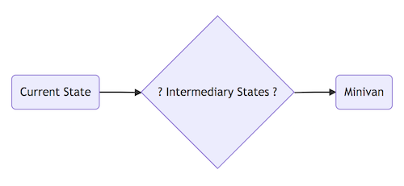
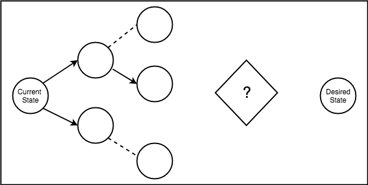

# Visions, Projects & Priorities: Using Temporal Graphs to Build Your Own Reality

There’s a huge problem in business right now: the best prioritizers, decision makers, visionaries, and “shapers” use their abilities to disproportionately benefit themselves. Deciding “what’s next” is one of the most difficult parts of leadership, but there are very few resources on making good mid and long term decisions, weighing decisions for priority and optimizing complex decision options. Without long term vision, and structured approach to creating a reality, companies are prone to fall into making decisions based on local optima: “What’s the best move right now” or making decisions optimized around short delivery intervals: “What’s the highest value thing to do in this interval”. This post explores the concept of temporal graphs and how they can be used to reason about reality and construct timelines in order to reason about long term initiatives.

## Temporal graphs

Temporal Graphs provide a way to reason about causality. Every action made creates opportunity for new actions. Have you ever read a choose your own adventure book? Most pages are left with a choice, and each choice either opens up the possibility to make more choices or lose choices.

Consider a case where you had an option to walk to work ~30 minutes, or drive to work ~20 minutes unless you hit traffic.  You choose to drive because you worked out extra hard last night.

  

In the walk scenario, getting delayed from traffic is nearly impossible; there are an almost infinite other ways to get delayed, but the chances of getting delayed because of traffic is minimal. At every moment in time there are a near infinite number of choices to make. Looking back over all choices that we made creates a path through a near infinite graph that we call our life. Where we are is a result of the decisions that we made, the decisions that other people made, and random luck. Successful projects and successful businesses also can be traced through a series of events; events that span conscious choices as well as strings of random events. Whatever the event's driver, at each movement in time there was a set of possible events, one of which happened, opening up another set of possible events, until arriving at right now.

## End States

End States are critical at the top level of business and projects for success. It's unrealistic to hope to succeed as a by product of random luck or favorable events from other people. Because of this, leaders need to have clear end states, be able to explain those end states, and execute to achieve those states. A leader in this case is anyone with a stake at moving the company to a different state (ie anyone responsible for changing the company).

Let's walk through an example of how end states can be thought about and visualized. In order to do this, pretend I have a growing family and I determine there's a need for a mini-van.

  

The vision is to get a minivan to provide more space for the family. The current state and end goal are very clear but there's no defined path in between. While visualizing an end state is better than nothing, it provides very little value to have a dream but no path to it. Without a concrete path an end state is just a hope, a nice idea.

## Intermediary states

Intermediary states are a series of causal events that can transform the current state into the desired state.  At the highest level these are logical events and are notable events in the transformation of the current state to the desired.

  

Each one of these states lead to the end goal. The level of abstraction here is intentionally high level. For vision and roadmaps, the level only needs specific enough to clearly convey the thought process and explain and convince others how the current state can be transformed into the desired state.

## Levels of intermediary states (Abstraction)

### Logical Strategy

What we've been talking about up until this point is the Logical strategy. Logical strategy is a list of causal states that leads from one state to another but intentionally avoids getting too detailed.

  

### Execution Strategy

Execution strategy is something that can be decomposed and handed out to people to begin to execute, the Sell Old Car state might have a temporal graph that looked like the following:

  

### Day to day (Executable) Strategy

This level is focused on concrete work items. Executable strategy further breaks down the execution strategy from above. The "Prepare car" state from above might have an Executable Strategy of:
- Vacuum car
- Schedule detailer
- Fix muffler

Likewise "List on Website 1" may require states:
- Create an account
- Take photos
- Write description
- List 

These are scoped to the sorts of tasks an Independent Contributor would be doing in order to execute on the vision at the lowest actionable level.

## Goals

Temporal Graphs are helpful at showing how actions lead to outcomes. One common that  teams or individuals have goals: adopting a new technology or tool, learning a new language, saving for vacation. Without concrete events connecting the current state to the end state (the goal) there is no path to the goal.

  

Hoping to learn a new language without or make a vacation a reality without saving are missing all the intermediary states.

## Exploration Breadth First

Establishing a vision may involve some steps that are unknown or need to be discovered. The goal of exploration is to open up favorable situations by learning about potential intermediary states that might lead to the end goal. There are many tasks that aren't know beyond one or two steps these require exploration in order to get an idea of the possible paths , idea validation, product discovery, customer feedback all help create nodes on the graph and open up possibilities.

  

Exploration is necessary when there are unknown intermediary states.

## Pruning and Probabilities

We prune graphs all the time with the hopes of invalidating (fail fast) and removing parts of the graph that can't help arrive at end state. If our goal is to arrive to work dry and we commute on foot or by bike, we consult the weather. If there is low likelihood of precipitation there's no need to plan, pack or carry rain gear, in this case planning for rain (by carrying gear) was pruned from intermediary states based on the probability of rain. Each work item carries with it an opportunity cost. Pruning and probabilities helps to quickly prioritize events that we shouldn't plan for or paths that shouldn't be taken due to low likelihood or sub optimal expected outcomes.

## Inexperienced Leadership

One pattern I regularly see are people in leadership either unwilling or unable to define and communicate a vision. Most of the time this is from in experience or not having certain leadership positions filled. It's difficult to communicate a vision if a leader doesn't have one. This manifests as moving away from the current state instead of towards an end state:

  

  

Communicating a vision (end state) and a path for making it a reality is one of the most important things in leadership. Inexperienced leaders are often unable or unwilling to do this. A vision is a bold bet and requires confidence, research and commitment. It's also often easier to incrementally improve the current state and label that as "Success" than painting a vision of the future and how to get there.

Another Leadership anti-pattern is communicating an end state without the intermediary states. Remember from the first step of the mini van. Having a vision without the concrete steps means its just a hopeful vision. One thing to keep in mind is that a leader will most likely not be filling in all the intermediary states, they orchestrate the reality not perform and define every single piece of work.

## Why?
Temporal Graphs are significant because making decisions, prioritizing and executing is hard! Many times instead of moving towards and end state we're just trying to incrementally improve the current one. There are surprisingly few heuristics or strategies about decision making in terms of roadmaps, priorities or execution. Shapers see an end goal and can motivate others to fill in the middle states. Project management is very interested in the middle states. Visionary leaders ("Shapers" as Ray Dalio refers to them) are able to do reason about the long term as well as the short term and execute on any level of temporal graphs.

Project management is interested in the end state and specifics of all in between states. Independent contributors are interested in Executable strategies. Project success requires understanding the logical vision, and understanding how each layer contributes to the overall success of the vision. I believe that understanding reality, and projects as a series of events that form a graph can help give a foundation for project success.

## Conclusion

Project management and priority is one of the most difficult skills required for leadership. Thinking of projects as a graph of states can help to ground those complexities, and give a framework to reason about how to change the current state into desired state. Not understanding and conveying causality severely handicaps projects. Where are you going and how are you getting there?
