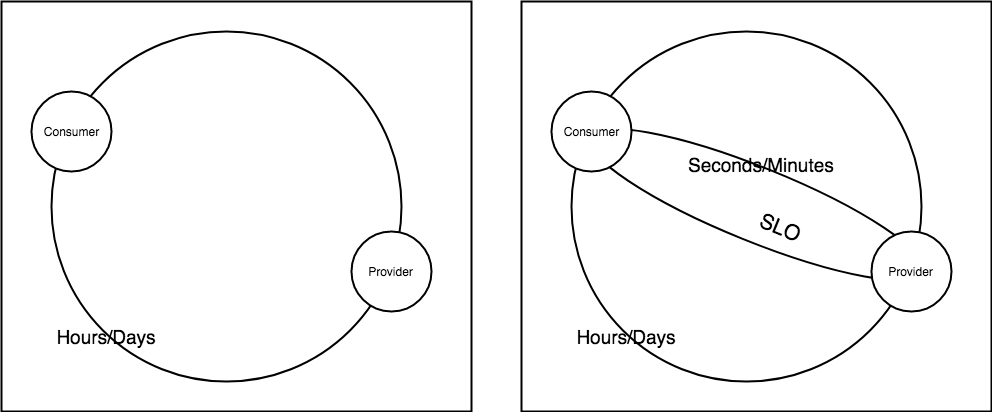

# SRE: Strategy: Deploying SLOs Across An Organization

The Google SRE book revolutionized operations by providing the theory and practice behind SLOs but largely leaves implementation [strategy](https://lethain.com/strategies-visions/) up to individual adopters. The why behind SLO's was explained but not the how. This post outlines a strategy for deploying SLO's across an organization based on my single successful experience.  It outlines the principles/constraints around the solution and then proposes a solution that respects those constraints.  This posts outlines a technical strategy to deploy SLO's across an organization; allowing every team to incorporates SLO's into their specific services and to start making decisions based on those SLO's.

## What is An SLO?
This post largely assumes that the reader is already familiar with [SLO's as defined by google](https://landing.google.com/sre/sre-book/chapters/service-level-objectives/).  SLO's establish a link behind a service provider (engineers) and a client, and makes that link visible and actionable.

  

From a structure point of you it is that wishes and add sure a link between an engineering team directly responsible for providing a service in the client This link creates a feedback loop which allows a service provider to understand their clients experience and take action on that.

  

From the systems perspective SLO's facilitate a feedback loop between the client and the service provider. Without this feedback loop client issues would have to propagate through the organization (account manager through the product owner and finally to the team) in order to reach the service provider. With times zones thrown in for an international company this could easily take hours or days before client's experience is addressed.  The feedback loop created by SLO's have the potential to support immediate response and detection. SLOs can achieve this link by choosing signals that provide high fidelity for what a client is experiencing.

## Principles

A good organizational deployment of SLO's will should optimize for the following principles:

- Represent the client experience
- Actionable (Alerts, Data informed decisions)
- Minimal investment (low technical overhead / Minimal moving parts)
- Low false positive rate (Minimal flakiness)

### Represent the client experience

SLOs aim to establish a connection between the service provider and the client.  It follows that an SLO based on signals closer to a client is more faithful to their experience than one farther away.  This principle favors a solution that generates the client data closest to the client. The closer to the client experience that the SLO data is generated.  Ideally there would be perfect visibility into all clients. Most of the time this is not possible because clients can be outside the organization, or custom.

  

Since SLO is focused on client its favorable to have metrics originating.  This means that measure at the client request level is preferable to the LB or the service level.  Some SLO's will NEED to be measured aat these levels (and each of these will surface critical metrics), but the rollout will favor metrics closer to the client.

### Actionable

In order to shorten feedback loops between a client and a service prover SLO's need to be actionable. This can be thought of as "alertable".  Teams need to be alerted when their client experiences are degraded, and should be woken up when the client experience is fully inhibited.  This is basically a chat and alert integration with some basic threshold and arithmetic alerting support.

### Minimal Investment / Low Techncinal Overhead

This should be called about because teams may have a wide variety of operation experience, experience instrumenting observing and responding to their services.  Additionally, implementation should be able to change fluidly under the chosen strategy.  A team using ELB vs ALB, or one Middleware vs another middleware HTTP framework, should have a uniform alerting, monitoring and operational SLO experience.  The fewer moving parts and required infrastructure the better.

### Low false positive

This is critically important for the initial rollout.  Just the concept of SLO and alerting, and infrastructure monitoring may be new to teams.  A Low false positive for SLO metric collection is required in order to facilitate adoption and to increase faith in SLOs.  The signal that is chosen should be a high fidelity representation of the client experience.  If the signal is in the red, it should mean there is a serious issue with the client's experience.  For adoption the breadth of testing is not as important as minimizing overhead.

## Proposal

Availability using black box probes fulfills the constraints above.  Availability is if a service is reachable or not.  It can easily be executed as an individual client (on the public internet through a service like pingdom) or on an internal network (for the case of internal clients).

Availability answers "Is the service reachable from a client?" It is a precursor to all other monitoring and Service levels.  By using such a primitive it optimizes ease of operation minimizes flakiness, and enables teams to start leaning on signals representing their client's experience, collecting, measuring and responding.

  

Availability probes provide a strong signal for correlationn of failures during incidents. Being able to quickly undnerstannd if if a failure is at the network/application level is a huge insight.  This signal supports triangulating an experience with a known experieince (the prober).

This enables teams to understand what proactive monitoring is, and enables them to begin to catch issues before clients. 

Probing is extremely low friction way to deploy SLO's across an organization.  Services exposed on the public internet can be trivially probed through services like pingdom or datadog synthetics.  Internal services can be trivially probed through tools like cloudprober or datadog HTTP Check.  A technical approach might look like:

- Choose an external probing service 
- Choose an interal probing solution
- Choose a service
- Setup a probe using the correct probing service (external|internal)
- Probe should ping a simple route in order to establish if the service is reachable
- Setup Alerts on probes that are failing for some period of time

I have found that this approach provides a low effort, easy to understand solution that provides high fidelity information about the state of a service.  If this probe fails it is extremely likely that there is an issue reaching the target and that paying clients are sharing that experience.

## References
- https://landing.google.com/sre/workbook/chapters/alerting-on-slos/
- https://medium.com/dm03514-tech-blog/sre-availability-probing-101-using-googles-cloudprober-8c191173923c
- https://landing.google.com/sre/sre-book/chapters/service-level-objectives/
- https://medium.com/dm03514-tech-blog/sre-debugging-strategies-triangulation-efc5f796205c
- https://lethain.com/strategies-visions/
