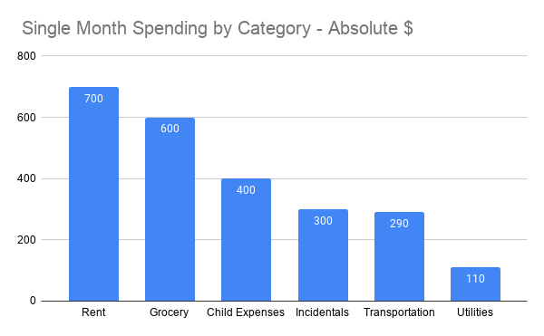
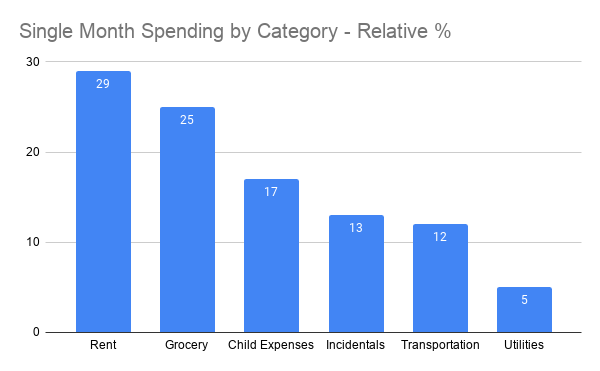
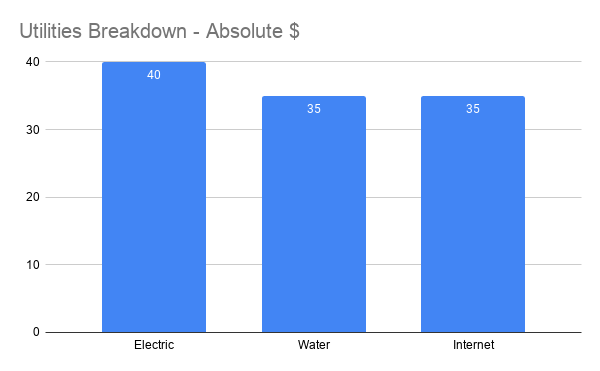

# Systems Fundamentals: Profiling

Successfully changing systems requires an understanding of the current system's state. Profiling is a tool for understanding systems at a point in time. Without a good understanding of the current state, changes can be suboptimal, counter productive, or even dangerous. Profiling is used to breakdown a system's current state using dimensions, and is a prerequisite for successfully modifying systems.

# What is Profiling?

Profiling describes the current state of a system. Knowing the current state helps to inform changes. Consider the following goals and how profiling helps each.

- Reduce monthly spending. Requires understanding current spending.
- Eat healthier. Requires understanding what you're currently eating.
- Reduce electricity. Requires understanding the current breakdown of usage.
- Promote hiring diversity. Requires understanding employee breakdown by gender/demographic.
- Reduce / Consolidate debt. Requires understanding debt sources by lender.
- Diversify an investment portfolio. Requires understanding investments by category/risk.

Profiling shows a snapshot of a system at a point in time broken down by a series of dimension. Consider the goal to reduce monthly spending. Cutting spending requires understanding the breakdown of spending, and this is what profiling does. Profiling takes an overall number such as the amount of money someone spends in a month and splits it across a dimensions, such as "spending category". Online banks such as Bank of America provide this view with their accounts:

  

The profile shows the total monthly spending of $2400 broken down by spending category. The categories follow including the amount of spending:

- Rent - $700
- Grocery - $600
- Child expenses - $400
- Incidentals - $300
- Transportation (payment, insurance, fuel) -$290
- Utilities - $110

Each category shows the total amount of monthly budget spent. It's easy to see that rent is the largest contributor to monthly spending for this month. Choosing a relevant dimension is part of profiling. This type of profile is called an "absolute" profile, since it includes the total amount of dollars for each dimension. 

A "relative" profile is another type of profile. Relative profiles list each value of the dimension along with the percentage of the total. 

  

Below lists the percentage based profile using the data from the absolute profile above:

- Rent - 29% ($700 / $2400)
- Grocery - 25% ($600 / $2400)
- Child expenses - 17% ($400 / $2400)
- Incidentals - 12.5% ($300 / $2400)
- Transportation (payment, insurance, fuel) - 12% ($290 / $2400)
- Utilities - 5% ($110 / $2400)

In a relative profile each dimension lists it percentage of the total. The profile above shows that rent is responsible for 29% of total monthly spending, while utilities only account for 5% of the total spending. When profiling it's useful to include both an absolute and percentage profile. This makes it easy to analyze the relative impact of a change in a dimension and then convert that to an absolute impact.
 
Profiles are often an aggregation of data. In the case of spending a full complete data of every single transaction is available through a bank statement but if there are many transactions it can be hard to digest. In this case a category is chosen and the data is broken down into a profile by that category which helps to get a full view of spending for a given transaction statement!

A profile of your own spending may produce different categories. Visualizations aren't necessary for profiling but can help to easily compare dimensions. The profile could be listed as a table or plain text, which is common for many business accounting reports. Profiling is frequently done within the context of accounting since data is often plentiful.

# Why Profile? - Risks of Not Profiling

Profiling is essential to system design. Image someone who wants to reduce their monthly expenses to put more money in savings, but has not performed a profile. The person feels like they are spending a lot of money on utilities so they resolve to try really hard to reduce their electricity consumption by cutting costs. At the same time they are spending $400 a week on eating out! There is more room for them to save money from 

Profiling is about information and getting a complete view into the state of a system at a point in time. This information can be used to understand the state of something and make informed decisions. Profiles show an objective breakdown of all sources for a certain behavior. If profiling isn't performed information can be missed. Effort There are a few risks with not performing a profile:

- Information can be missed since a complete view of the current state of the system is missing, may think that the breakdown is x and y and focus on x, but at the same time not even consider z.
- Policies can target incorrect groups if profiling is not performed. 
- Unable to verify the effects of actions. If the goal is to consolidate debt then a profile should be taken before consolidation, and after consolidation. The second profile will show if consolidation was successful.

# How

The process of profiling is simple once data is acquired. Profiling relies on rich data and data acquisition is often the hardest part of profiling.

- Identify dimensions: How will the profile be split? Which categories/dimensions will the profile breakdown?
- Collect data: Where will data come from? How is complete data gathered? 
- Break down data, Percentage & Absolutes: Use a spreadsheet, database system, or hosted application to breakdown the data by the targeted dimensions. (The graphs above were generated using google sheets.)

## Profile Profiles "drilling-down"

Profiles aren't limited to a single dimension. It's often helpful to break down profiles into multiple dimensions. Continuing with the spending profile above, a multi-dimensional profile would breakdown each spending category into absolute source. The following chart shows a profile of only the "Utilities" category which totaled $110:

  

Profile of profile enabling "drilling-down" into more and more specific categories of data. It's important to note at some point the data ends and can no longer be drilled into. In the case of spending the smallest unit is an individual transaction.

# Conclusion

Profiling defines: What's happening right now in a system. Profiling focuses on understanding a system at a current point in time. Profiling defines the state of the system by dimensions, which are attributes of the system. It is a primitive tool that helps to perform more detailed system analyses.  
