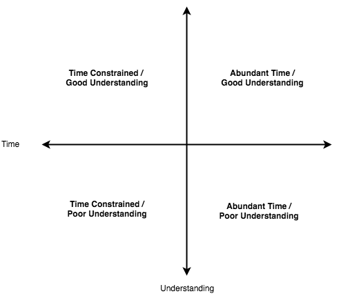

# Technical Debt: Imperfect Information And Time Constrained

Technical Debt occurs when there is there is a local optima solution. This commonly occurs when there there is poor understanding of the system combined with a time constraint. Viewing technical debt as a systems problem along the dimensions of time and system understanding can lead to insights on how better alignment can help reduce technical debt in projects.  Time and System Understanding are two common contributors to technical debt, this blog explains how they are related, how they can promote or reduce technical debt, and some strategies for keeping technical debt at bay.

# An Anectode

This week I had a task changing the initialization of a service.  I had spent a number of hours trying to undnerstanding the complex innitialization of a service.  IN order to minnimize risk moving the initiaalization around:

ORCHESTRATING UNDERSTANDING

This is essentially understanding what order a complex graph of dependencies can be executed in:

I had spent about 4 hours understanding this inintialization and during a standup mentioned this:

My coworker told me to setup a runtime invariant that just check and fail if it's dependencies aren't yet initialized:

LOCALIZED CHANGE TO CREATE INVARIANT

There was a time continum that 

IN THIS CASE HIS CHANGE WAS STRICTLY BETTER BECAUSE IT MET OUR TIME REQUIREMENTS but got me thinking of the two appproaaches in the context of the system as a whole:

The first component is my approach: It took a broader understanding of the system:

Which would have **eventuaally** been valid (after some unknown number of more hours)
Devlop aan understanading of the full system vs part of the system.

The next dimension wsa comparing the two options on a time tradeoff:
My coworkers solution was proven to work and I had already taken a large amount of time working on services I wasn't familiar with:

TIME TRADEOFF

Combining these in 2 dimensions creates a time  undesrtanding space:

  

#### Time Constrained / Poor Understanding

Technical Debt, 
Locally Optimized solutions

#### Abundant Time / Poor Understanding
Opportunity to learn the system and develop an understanding
Huge risk to fail without time constraints
