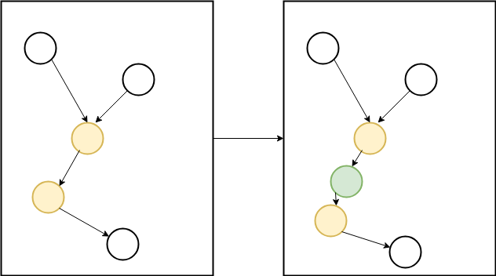
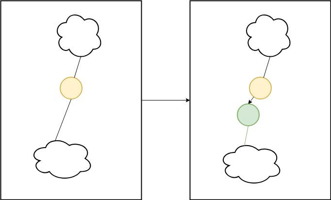

# Technical Debt: Imperfect Information And Time Constrained

Technical Debt occurs when there is a local optimum is prioritized over a global solution. This commonly occurs when there there is poor understanding of the system combined with a time constraint. Viewing technical debt as a systems problem along the dimensions of time and system understanding can lead to insights on how better alignment can help reduce technical debt in projects.  Time and System Understanding are two common contributors to technical debt, this blog explains how they are related, how they can promote or reduce technical debt, and some strategies for keeping technical debt at bay or removing it completely.

## An Anecdote

This week I had a task that required changing the initialization of a service. I had spent a number of hours trying to understanding the complex initialization of a service. In order to minimize risk moving the initialization around. This is essentially understanding what order a complex graph of dependencies can be executed in:

  

I was tryign to develop aa systems understading of each of the major components and how they interacted. I had spent about 4 hours understanding this inintialization.  During standup I had mentioned that I was still trying to understand the initialization when a coworker suggested that I setup a runtime invariant that just check and fail if it's dependencies aren't yet initialized.  This approach narrowed in on the specific component that needed to be changed without having to invest the time to understand each component and how they interact:

  

The approaches existed along a time conntinuum: Mine taking much longer to achieve the intended outcome with his being much faster.  Both approaches were equally effective at minimizing risk.  In this case his approach was much better because it met our time requirements, and involved a project that we rarely touched, so investing time was a poor return onn investment.  This got me thinking of the two appproaaches in the context of the system as a whole.

The first component is the first approach which I'll call a "Systems Approach", which takes a broader understanding of the system.  This approach would have **eventually** been valid (after some unknown number of more hours) and invovled developing an understanading of the full system vs part of the system. It maximizes knowledge at the cost of time.

The second approach was a local Optimum and was able to achieve results in constrained time, by ignoring the larger system.  This approach minimizes time by minimizing knowledge.

## Understanding / Time Tradeoff 

Combining these in 2 dimensions creates a time understanding space:

  

This results in 4 quadraants with very interesting characteristics:

#### Time Constrained / Poor Understanding (Local Optimum)

This promotes locally optimized solutions which is likely to result in technical debt.

#### Time Constrained / Good Understanding

This is able to deliver solutions which consider the affect on the global system.  This is the golden zone and what organizations should shoot for.  There are a number of technical and organizational approaches that can be used to achieve this. 

#### Abundant Time / Poor Understanding
This is a dangerous area.  It can either provide an opportunity to learn the system and develop an understanding of the system.  This is also a huge risk to fail without time constraints.  Unfortuntely failing without constraints is real.  I didn't think it was possible but I witnessed a project not having any accountaability unable to deliver to any expectations until it finally resulted in completely failure and had to be scrapped.  The project probably cost close to 6 figures, and then had to be completely re-started from the ground up.

## A Series of Tradeoffs 
Each approach (local optimum or maintaining a system view) makes significant tradeoffs along the delivery-time dimension.  One delivers on a fast timeline while sacrificing a system view, resulting in technical debt, while the other requires regular time investment while maintaining the system view.

This tradeoff should be intuitive, and industry talks about it frequently; as soon as the system view is lost it results in technical debt.  Repaying that technical debt ennables regaining the system context which usually requires an increase in technical resources.  This is exactly what is meant by paying down technical debt: developing a a system view and begining to evolve within a system context instead of a making local optimum changes.

One reason that [rewrites/migrations](https://lethain.com/migrations/) are an effective way to temporarily address technical debt is because they reset the system context.  They force a new system view.

There are many technical strategies that can help maintain a system context throughtout the lifetime of a project, while minimizing overhead. These can help completely avoid the cycle of locally optimized solutions, increasing technical debt a then a big push to rewrite or reduce technical debt.  These are:

- [High Level Service Tests](https://medium.com/dm03514-tech-blog/service-level-test-stacks-in-action-using-go-a77a0e808b1c)
- [Architectual Decision Records](https://github.com/joelparkerhenderson/architecture_decision_record)
- System/Transaction Diagrams / (Distributed tracing)

Another approach to maintaining system context is around alignment.  In order to keep the system's persepective, engineners familiar with the system (knowledge) should be alignned with doing the work or curating the work. This maakes it more likely that the systems view will be present throughout the lifecycle of the project.

## References
- https://lethain.com/migrations/
- https://medium.com/dm03514-tech-blog/service-level-test-stacks-in-action-using-go-a77a0e808b1c
- https://github.com/joelparkerhenderson/architecture_decision_record

